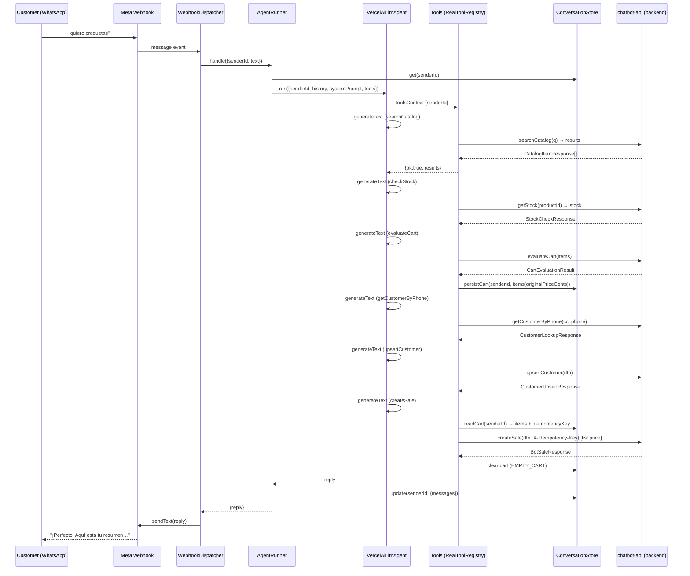
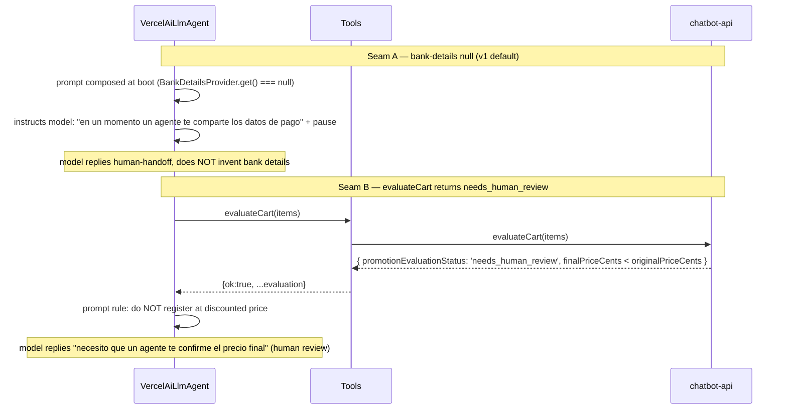

# Design: Sale Flow (tools + cart + prompt)

## Technical Approach

Replace the placeholder `InMemoryToolRegistry` with a `RealToolRegistry` that registers the
nine chatbot-api sale-flow tools as AI-SDK `tool()` + Zod objects, backed by the existing
`ChatbotApiHttpClient` and `ConversationStore`. The tools live in a **new `SaleFlowModule`**
(`src/sale-flow/…`) that `LlmAgentModule` imports; `LlmAgentModule` rebinds `TOOL_REGISTRY` to
`RealToolRegistry` (one-line `useExisting`, so rollback to `InMemoryToolRegistry` stays a one-liner).

Cart state persists per-sender under `ConversationState.data.cart` (no new table, no migration).
`evaluateCart` is the cart **writer** (it quotes the cart AND persists the backend-authoritative
`originalPriceCents` as `unitPriceCents`); `createSale` is the cart **reader** (it enforces
list-price from the persisted cart, manages the client-side UUID v4 idempotency key, and clears
the cart on success). Because the spec pins the 9-tool set, there is **no** dedicated
add/remove-cart tool — the model mutates the cart by recomposing the `items` it passes to
`evaluateCart`.

The system prompt becomes `SYSTEM_PROMPT + '\n\n' + SALE_FLOW_INSTRUCTIONS`, composed **once at
boot** through a new `LLM_AGENT_SYSTEM_PROMPT` token. A swappable `BankDetailsProvider` port
(default `null`) is consulted at boot; `null` keeps the prompt exactly
`SYSTEM_PROMPT + '\n\n' + SALE_FLOW_INSTRUCTIONS` (the v1 human-handoff path), while a future
impl appends the real bank-details block without touching the tools, the model, or the
`SALE_FLOW_INSTRUCTIONS` literal.

Per-request `senderId` reaches the cart-touching tools through the AI-SDK `toolsContext`
mechanism (each cart tool declares `contextSchema: z.object({ senderId: z.string() })`), which
keeps the UNCHANGED `ToolRegistry.getTools()` port and the `(deps) => tool(...)` factory pattern.

`CHATBOT_API_CASHIER_USER_ID` (Joi `uuid`, required) is the only new env var; it is injected
server-side into `createSale` (the model can never choose the cashier). No bank-details env vars
are added.

---

## Architecture Decisions

| Decision | Choice | Rejected | Rationale |
|---|---|---|---|
| **Module structure** | Separate `SaleFlowModule` (`src/sale-flow/`) owning tools + cart + bank-details seam + instructions; `LlmAgentModule` imports it and binds `TOOL_REGISTRY → useExisting: RealToolRegistry` | Tools + registry inline in `llm-agent` | (a) matches the approved proposal (`src/sale-flow/…`) and screaming-layout convention; (b) keeps the generic agent loop (`llm-agent`) decoupled from the concrete sale-flow business capability; (c) the UNCHANGED `TOOL_REGISTRY` port lives in `llm-agent` while the swappable impl lives in `sale-flow`; (d) rollback = one-line binding revert. |
| **Error envelope** | Tools catch `ChatbotApiError` subclasses and return `{ ok: false, error: { kind, retryable } }` (exactly two fields); success is `{ ok: true, ...payload }` | Return raw thrown errors / HTTP status / stack traces | The model must phrase a friendly reply from a stable, small vocabulary; deep-equal spec scenarios pin the exact two-field error shape. |
| **`validation` kind** | Backend 4xx that isn't 401/403/404/429 (client surfaces these as `UpstreamError` with a 4xx `statusCode`), OR explicitly-detected invalid payloads (e.g. `createSale` before `evaluateCart`) | Treat 400/422 as retryable upstream | `ChatbotApiHttpClient.mapError` maps 400/422 into `UpstreamError(statusCode)`. Mapping them to retryable `upstream` would mislead the model into retrying an unfixable payload. |
| **Zod parse failures** | Handled at the AI-SDK tool boundary (SDK validates `inputSchema` before `execute`) | Map Zod errors to `validation` inside `execute` | Zod failures never reach `execute`; they surface to the model as a tool-input error automatically. `validation` is reserved for backend 4xx / explicitly-detected bad payloads. |
| **Idempotency key source** | Client-side `crypto.randomUUID()` generated on first `createSale` attempt, persisted on the cart, reused on retry, cleared on success | Server-assigned / env var | The backend `SaleIdempotency` table keys on the header value; a client UUID v4 is stable across retries within the sender session and requires zero backend change. No env var (client-side only). |
| **Cart storage location** | `ConversationState.data.cart` (existing `[key: string]: unknown` bag) via `readCart`/`writeCart` | New table / migration / module-owned store | The `conversation-store` spec already guarantees arbitrary data round-trips; adding a table would violate the consumer-only + no-migration constraints and add dead weight for a per-sender bag. |
| **Prompt composition point** | `LLM_AGENT_SYSTEM_PROMPT` token bound in `LlmAgentModule` (one-shot at boot) | `ConfigService`/`configuration.ts` per-turn, or runtime override | The runner's "MUST NOT override at runtime" contract is preserved: composition is a single factory value at boot, cached in `AgentRunner`. `configuration.ts` is not coupled to sale-flow text. |
| **`BankDetailsProvider` seam** | Port + `NullBankDetailsProvider`; consulted **once at boot** by the prompt factory; `null` → prompt is exactly `base + slice` (human-handoff phrase lives in `SALE_FLOW_INSTRUCTIONS`) | env var for bank details, or a 10th tool | A port is swappable via DI without touching tools/model/prompt literal. No env vars (spec). A 10th tool would violate "exactly nine". |
| **Per-request `senderId`** | AI-SDK `toolsContext` + per-tool `contextSchema`; `VercelAiLlmAgent` forwards `toolsContext` built from `input.senderId` | Change `getTools(senderId)`, or `AsyncLocalStorage` | Keeps the UNCHANGED `getTools()` port and the `(deps)=>tool(...)` factory. `AsyncLocalStorage` is a viable fallback but the native SDK mechanism is less magic and already typed. |
| **List-price enforcement** | `evaluateCart` persists `unitPriceCents = originalPriceCents`; `createSale` overrides each line's `unitPriceCents` from the persisted cart | Trust the model's `unitPriceCents` input | The spec's "MUST NOT contain 800" scenario is deterministic only if the tool enforces price, not the model. |

---

## Architecture Overview

### DI graph (production)

```text
AppModule
 ├─ AppConfigModule.forRoot()          (global ConfigModule)
 ├─ ConversationModule ──► exports CONVERSATION_STORE
 ├─ ChatbotApiModule  ───► exports CHATBOT_API_CLIENT
 ├─ LlmAgentModule ─────► imports ConfigModule, ConversationModule, ChatbotApiModule, SaleFlowModule
 │    ├─ GENERATE_TEXT            (useValue: generateTextImpl)
 │    ├─ LLM_AGENT                (useFactory → VercelAiLlmAgent)
 │    ├─ TOOL_REGISTRY            (useExisting: RealToolRegistry)      ← rebind
 │    ├─ LLM_AGENT_SYSTEM_PROMPT  (async useFactory, injects BANK_DETAILS_PROVIDER)
 │    ├─ CostGuardService
 │    └─ AgentRunner              (injects CONVERSATION_STORE, LLM_AGENT, TOOL_REGISTRY,
 │                                 CostGuardService, ConfigService, LLM_AGENT_SYSTEM_PROMPT)
 └─ WhatsappModule ──► injects AgentRunner into WebhookDispatcherService

SaleFlowModule
 ├─ imports ChatbotApiModule, ConversationModule
 ├─ providers:
 │    ├─ RealToolRegistry       (injects CHATBOT_API_CLIENT, CONVERSATION_STORE,
 │    │                           BANK_DETAILS_PROVIDER, ConfigService)
 │    └─ BANK_DETAILS_PROVIDER  (useClass: NullBankDetailsProvider)
 └─ exports: RealToolRegistry, BANK_DETAILS_PROVIDER
```

Provider tokens (all Symbols): `CHATBOT_API_CLIENT` (existing, `chatbot-api`), `CONVERSATION_STORE`
(existing, `conversation`), `TOOL_REGISTRY` (existing, `llm-agent`), `LLM_AGENT` (existing),
`GENERATE_TEXT` (existing), **`LLM_AGENT_SYSTEM_PROMPT`** (new, `llm-agent/domain/system-prompt.ts`),
**`BANK_DETAILS_PROVIDER`** (new, `sale-flow/domain/bank-details.provider.ts`).

**Consumer-only constraint (config rule `rules.design`)**: the only persistence this slice writes is
its **own** `ConversationStore` (`ConversationState.data.cart`) — the chatbot's existing per-sender
bag. Every business write (customer upsert, sale creation, receipt attach, delivery update) flows
exclusively through the `chatbot-api` HTTP client; there is **no** direct `houndfe-backend` database
write, no new table, and no migration anywhere in this slice.

### Data flow (one inbound turn)

```text
Meta webhook → WebhookDispatcherService → AgentRunner.handle({ senderId, text })
  ├─ store.get(senderId)                    (idle check + in-memory truncation)
  ├─ llm.run({ senderId, history, systemPrompt, tools })          ← tools = registry.getTools()
  │    └─ VercelAiLlmAgent → generateText({ ..., tools, toolsContext: {…senderId…}, stopWhen })
  │         └─ tool execute(input, { context: { senderId } })
  │              ├─ readCart/writeCart → store.get/update(senderId)
  │              └─ chatbotApi.<method>(...) → { ok:true, … } | { ok:false, error:{kind,retryable} }
  ├─ costGuard.record(usage)
  └─ store.update(senderId, { lastMessageAt, data: { messages } })
```

---

## File Map

### New — `src/sale-flow/`

| File | Responsibility |
|---|---|
| `sale-flow.module.ts` | Composition root: imports `ChatbotApiModule` + `ConversationModule`; provides `RealToolRegistry` + `BANK_DETAILS_PROVIDER` (null default); exports both. |
| `domain/cart-state.ts` | `CartItem`, `CartState`, `EMPTY_CART`, pure `readCart(state)`, pure `writeCart(state, patch)`. |
| `domain/bank-details.provider.ts` | `BANK_DETAILS_PROVIDER` symbol; `BankDetails` (`bankName`,`beneficiary`,`clabe`,`accountNumber`); `BankDetailsProvider { get(): Promise<BankDetails\|null> }`. |
| `domain/sale-flow-instructions.ts` | `SALE_FLOW_INSTRUCTIONS` literal (14-step escrow flow + required strings); `composeSaleFlowSystemPrompt(base, bankDetails)` + `renderBankDetailsBlock(details)`. |
| `domain/tool-result.ts` | `ToolErrorKind`, `ToolErrorResult`, `ToolSuccess<T>`, `ToolResult<T>`. |
| `application/tool-deps.ts` | `ToolDeps = { chatbotApi, store, bankDetails, cashierUserId }` shared by all factories. |
| `application/error-mapping.ts` | `mapChatbotError(err): ToolErrorResult` (see Tool Design). |
| `application/cart-persistence.ts` | `persistCart(store, senderId, state, nextCart)` — wraps `store.update` with the `data.cart` replace. |
| `application/tools/search-catalog.tool.ts` | `makeSearchCatalogTool(deps)` (§4.4.1). |
| `application/tools/check-stock.tool.ts` | `makeCheckStockTool(deps)` (§4.4.2). |
| `application/tools/evaluate-cart.tool.ts` | `makeEvaluateCartTool(deps)` (§4.4.3) — quotes AND persists the cart. |
| `application/tools/get-customer-by-phone.tool.ts` | `makeGetCustomerByPhoneTool(deps)` (§4.4.4). |
| `application/tools/upsert-customer.tool.ts` | `makeUpsertCustomerTool(deps)` (§4.4.5). |
| `application/tools/create-sale.tool.ts` | `makeCreateSaleTool(deps)` (§4.4.6) — idempotency + list-price + clear. |
| `application/tools/attach-receipt.tool.ts` | `makeAttachReceiptTool(deps)` (§4.4.7). |
| `application/tools/update-delivery.tool.ts` | `makeUpdateDeliveryTool(deps)` (§4.4.8) — registered, not exercised. |
| `application/tools/get-order-history.tool.ts` | `makeGetOrderHistoryTool(deps)` (§4.4.9). |
| `infrastructure/real-tool-registry.ts` | `RealToolRegistry implements ToolRegistry`; builds the 9-tool ToolSet once in its constructor. |
| `infrastructure/null-bank-details.provider.ts` | `NullBankDetailsProvider { get(): Promise<null> }`. |

### New — tests (`src/sale-flow/**/*.spec.ts`)

| File | Responsibility |
|---|---|
| `domain/cart-state.spec.ts` | `readCart` missing→empty; `writeCart` shallow-merge; full round-trip through a stubbed store. |
| `domain/sale-flow-instructions.spec.ts` | Composed prompt contains the 4 contract strings; `null` → exactly `base + '\n\n' + slice`; non-null appends bank block. |
| `application/error-mapping.spec.ts` | Each error class → exact `{kind, retryable}`; 4xx `UpstreamError` → `validation`. |
| `application/tools/*.spec.ts` (9 files) | Per-tool unit: endpoint mapping, Zod valid/invalid, error envelope; `createSale` idempotency/list-price/clear; `evaluateCart` persists cart. |
| `application/tools/tool-contract.spec.ts` | Shared contract suite: each tool has `description`/Zod `inputSchema`/`execute`; representative malformed inputs rejected. |
| `infrastructure/real-tool-registry.spec.ts` | `getTools()` returns exactly the 9 keys; DI binding pulls `CHATBOT_API_CLIENT` + `CONVERSATION_STORE`. |
| `infrastructure/null-bank-details.provider.spec.ts` | `get()` resolves `null`. |
| `sale-flow.module.spec.ts` | Module resolves `RealToolRegistry` + `BANK_DETAILS_PROVIDER`; re-exports `CHATBOT_API_CLIENT`/`CONVERSATION_STORE`. |

### Modified

| File | Change |
|---|---|
| `src/llm-agent/llm-agent.module.ts` | Import `ChatbotApiModule` + `SaleFlowModule`; bind `TOOL_REGISTRY → useExisting: RealToolRegistry`; add `LLM_AGENT_SYSTEM_PROMPT` async factory. |
| `src/llm-agent/application/agent-runner.service.ts` | Inject `@Inject(LLM_AGENT_SYSTEM_PROMPT) systemPrompt` instead of importing `SYSTEM_PROMPT`; `forTest` passes `config.systemPrompt`. |
| `src/llm-agent/domain/system-prompt.ts` | Add `LLM_AGENT_SYSTEM_PROMPT` symbol (`SYSTEM_PROMPT` byte-identical). |
| `src/llm-agent/infrastructure/vercel-ai-llm-agent.ts` | Forward `toolsContext` (per-tool `{ senderId }`) to `generateText`. |
| `src/config/env.validation.ts` | Add `CHATBOT_API_CASHIER_USER_ID: Joi.string().uuid().required()`. |
| `src/config/configuration.ts` | Add `chatbotApi.cashierUserId`. |
| `src/config/env.validation.spec.ts` | Missing / malformed cashier id cases. |
| `src/config/configuration.spec.ts` | `chatbotApi.cashierUserId` surfaced. |
| `src/llm-agent/llm-agent.module.spec.ts` | Assert `TOOL_REGISTRY` → `RealToolRegistry` with the 9 keys; assert `ChatbotApiModule`/`SaleFlowModule` imported. |
| `src/llm-agent/application/agent-runner.service.spec.ts` | Update to injected composed prompt (still byte-identical via `forTest`). |
| `src/llm-agent/infrastructure/vercel-ai-llm-agent.spec.ts` | Add `toolsContext` forwarding assertion. |

### Unchanged (explicitly)

- `src/chatbot-api/**` — client + DTOs already expose all 9 typed methods; `CreateSaleInput` already has `cashierUserId`.
- `src/conversation/**` — `ConversationStateData` already allows `[key: string]: unknown`.
- `src/app.module.ts` — `SaleFlowModule` is reachable transitively through `LlmAgentModule`.
- `src/llm-agent/infrastructure/in-memory-tool-registry.ts` — kept as a test fixture, no longer the production binding.

---

## Tool Design

### Factory pattern + result envelope

Every tool is a pure factory `(deps: ToolDeps) => tool({...})`. The AI-SDK `tool()` shape is
`{ description, inputSchema, contextSchema?, execute }` where `execute(input, options)` receives
`options.context` (the per-tool `toolsContext` entry), `options.toolCallId`, `options.messages`,
`options.abortSignal`.

```ts
// src/sale-flow/application/tool-deps.ts
import type { ChatbotApiClient } from '../../chatbot-api/domain/chatbot-api.client';
import type { ConversationStore } from '../../conversation/domain/conversation-store';
import type { BankDetailsProvider } from '../domain/bank-details.provider';

export interface ToolDeps {
  chatbotApi: ChatbotApiClient;
  store: ConversationStore;
  bankDetails: BankDetailsProvider;   // unused by v1 tools; seam for the post-Q1 bank-details tool
  cashierUserId: string;              // injected into createSale only
}

// src/sale-flow/domain/tool-result.ts
export type ToolErrorKind =
  | 'auth' | 'forbidden' | 'notFound' | 'rateLimit' | 'upstream' | 'validation';
export interface ToolErrorResult {
  ok: false;
  error: { kind: ToolErrorKind; retryable: boolean };
}
export type ToolSuccess<T> = { ok: true } & T;
export type ToolResult<T> = ToolSuccess<T> | ToolErrorResult;
```

### Error mapping (pinned)

```ts
// src/sale-flow/application/error-mapping.ts
export function mapChatbotError(err: unknown): ToolErrorResult {
  if (err instanceof AuthError)        return { ok: false, error: { kind: 'auth',     retryable: false } };
  if (err instanceof ForbiddenError)   return { ok: false, error: { kind: 'forbidden', retryable: false } };
  if (err instanceof NotFoundError)    return { ok: false, error: { kind: 'notFound',  retryable: false } };
  if (err instanceof RateLimitError)   return { ok: false, error: { kind: 'rateLimit', retryable: true  } };
  if (err instanceof UpstreamError) {
    const s = err.statusCode;
    if (typeof s === 'number' && s >= 400 && s < 500) {
      return { ok: false, error: { kind: 'validation', retryable: false } };  // 400/422 (PRICE_OUT_OF_DATE, bad state)
    }
    return { ok: false, error: { kind: 'upstream', retryable: true } };       // 5xx / network
  }
  if (err instanceof ChatbotApiError) {
    const s = err.statusCode;
    if (typeof s === 'number' && s >= 400 && s < 500) {
      return { ok: false, error: { kind: 'validation', retryable: false } };
    }
    return { ok: false, error: { kind: 'upstream', retryable: true } };
  }
  throw err; // BranchMismatchError / store failures: hard infra error → propagate → Meta re-delivery
}
```

- **`validation` is pinned**: backend 4xx that is **not** 401/403/404/429 (the HTTP client
  currently folds 400/422 into `UpstreamError(statusCode)`), **or** an explicitly-detected
  invalid payload (e.g. `createSale` before `evaluateCart` populated the cart).
- **Zod parse failures are NOT `validation`**: the SDK rejects them at the tool boundary before
  `execute`, surfacing a tool-input error to the model automatically.
- `BranchMismatchError` and `ConversationStore` write failures rethrow — they are configuration /
  infrastructure defects, not something to phrase nicely to a customer; the existing dispatcher
  re-throw → webhook 500 → Meta re-delivery path handles them.

### The nine tools (signatures, schemas, behavior)

Zod v4 note: the spec's prose `z.string().uuid()` / `z.string().url()` / `z.string().datetime()`
are deprecated aliases in `zod@4.4.3`; the snippets use the non-deprecated `z.uuid()`, `z.url()`,
`z.iso.datetime()`, `z.number().int()` (behaviorally identical; the contract tests assert parse
behavior, not helper identity).

| # | Tool | `inputSchema` (AGENTS.md §4.4 verbatim, minus injected cashier) | `execute` behavior / success payload |
|---|---|---|---|
| 1 | `searchCatalog` | `{ q: z.string().min(1), limit: z.number().int().min(1).max(20).default(10) }` | `chatbotApi.searchCatalog(q, limit)` → `{ ok:true, results: CatalogItemResponse[] }` |
| 2 | `checkStock` | `{ productId: z.uuid() }` | `chatbotApi.getStock(productId)` → `{ ok:true, ...StockCheckResponse }` |
| 3 | `evaluateCart` | `{ items: z.array(z.object({ productId: z.uuid(), variantId: z.uuid().optional(), quantity: z.number().int().min(1), unitPriceCents: z.number().int().min(0) })).min(1) }` | quote → **persist cart** → `{ ok:true, ...CartEvaluationResult }` |
| 4 | `getCustomerByPhone` | `{ phoneCountryCode: z.string().min(1).max(10), phone: z.string().min(1).max(20) }` | `chatbotApi.getCustomerByPhone(cc, phone)` → `{ ok:true, ...CustomerLookupResponse }` |
| 5 | `upsertCustomer` | `{ firstName: z.string().min(1).max(100), lastName?: z.string().max(100), phoneCountryCode: z.string().min(1).max(10), phone: z.string().min(1).max(20), preferredPaymentMethod?: z.string().max(50), address: z.object({ label?: z.string().max(100), street: z.string().min(1).max(200), exteriorNumber?: z.string().max(20), interiorNumber?: z.string().max(20), zipCode?: z.string().max(10), neighborhood?: z.string().max(100), municipality?: z.string().max(100), city?: z.string().max(100), state?: z.string().max(100), visualReferences?: z.string().max(500), carrierPhone?: z.string().max(20) }) }` | `chatbotApi.upsertCustomer(input)` → `{ ok:true, ...CustomerUpsertResponse }` |
| 6 | `createSale` | `{ customerId: z.uuid(), shippingAddressId: z.uuid().nullish(), items: z.array(z.object({ productId: z.uuid(), variantId: z.uuid().nullish(), productName: z.string().min(1), variantName: z.string().nullish(), quantity: z.number().int().min(1), unitPriceCents: z.number().int().min(0) })).min(1) }` | read cart → idempotency → enforce list price → `chatbotApi.createSale(dto, key)` → clear cart → `{ ok:true, ...BotSaleResponse }` |
| 7 | `attachReceipt` | `{ saleId: z.uuid(), mediaUrl: z.url(), declaredAmountCents: z.number().int().min(1), declaredDate: z.iso.datetime().nullish(), declaredReference: z.string().min(1).nullish() }` | `chatbotApi.attachReceipt(saleId, input)` → `{ ok:true, ...AttachReceiptResponse }` |
| 8 | `updateDelivery` | `{ saleId: z.uuid(), carrierName: z.string().min(1).nullish(), trackingRef: z.string().min(1).nullish(), estimatedDeliveryAt: z.iso.datetime().nullish() }` | `chatbotApi.updateDelivery(saleId, input)` → `{ ok:true }` |
| 9 | `getOrderHistory` | `{ phone: z.string().min(1).max(20), phoneCountryCode: z.string().min(1).max(10) }` | `chatbotApi.getOrderHistory(phone, cc)` → `{ ok:true, results: OrderHistoryResponse[] }` |

- `upsertCustomer.address.state` is `z.string().max(100)` (not a duplicated `MEXICAN_STATES`
  enum): the enum list lives only in the backend (`@IsIn(MEXICAN_STATES)`); an invalid state is
  rejected by the backend and surfaces as the `validation` envelope. This avoids drift between
  the two repos.
- `cashierUserId` is **not** part of `createSale`'s `inputSchema` — it is injected from
  `ConfigService` (`chatbotApi.cashierUserId`) in the tool deps, so the model can never pick it.

### Representative factories

```ts
// searchCatalog — stateless
export function makeSearchCatalogTool(deps: ToolDeps) {
  return tool({
    description: 'Busca productos en el catálogo por texto. Devuelve los resultados con precios y existencias.',
    inputSchema: z.object({
      q: z.string().min(1),
      limit: z.number().int().min(1).max(20).default(10),
    }),
    execute: async (input) => {
      try {
        const results = await deps.chatbotApi.searchCatalog(input.q, input.limit);
        return { ok: true, results };
      } catch (err) {
        return mapChatbotError(err);
      }
    },
  });
}
```

```ts
// evaluateCart — stateful (writes the canonical cart)
export function makeEvaluateCartTool(deps: ToolDeps) {
  return tool({
    description: 'Cotiza el carrito y guarda la lista de productos con precio de lista.',
    inputSchema: z.object({
      items: z.array(z.object({
        productId: z.uuid(),
        variantId: z.uuid().optional(),
        quantity: z.number().int().min(1),
        unitPriceCents: z.number().int().min(0),
      })).min(1),
    }),
    contextSchema: z.object({ senderId: z.string() }),
    execute: async (input, { context }) => {
      try {
        const evaluation = await deps.chatbotApi.evaluateCart(input.items);
        // Persist list price (originalPriceCents), NOT the model's input price.
        const items = evaluation.items.map((i) => ({
          productId: i.productId,
          variantId: i.variantId ?? undefined,
          quantity: i.quantity,
          unitPriceCents: i.originalPriceCents,
        }));
        await persistCart(deps.store, context.senderId, { items });  // keeps existing idempotencyKey
        return { ok: true, ...evaluation };
      } catch (err) {
        return mapChatbotError(err);
      }
    },
  });
}
```

---

## Cart State Design

```ts
// src/sale-flow/domain/cart-state.ts
import type { ConversationState } from '../../conversation/domain/conversation-store';

export interface CartItem {
  productId: string;
  variantId?: string;
  quantity: number;        // >= 1
  unitPriceCents: number;  // >= 0, list price recorded at add-to-cart time
}
export interface CartState {
  items: CartItem[];
  idempotencyKey: string;  // UUID v4 generated client-side on first createSale attempt
}
export const EMPTY_CART: CartState = { items: [], idempotencyKey: '' };

function isCartState(v: unknown): v is CartState {
  if (typeof v !== 'object' || v === null) return false;
  const c = v as { items?: unknown; idempotencyKey?: unknown };
  return Array.isArray(c.items) && typeof c.idempotencyKey === 'string';
}

export function readCart(state: ConversationState | null): CartState {
  const raw = state?.data?.cart;
  return isCartState(raw) ? (raw as CartState) : { items: [], idempotencyKey: '' };
}

export function writeCart(
  state: ConversationState | null,
  patch: Partial<CartState>,
): CartState {
  return { ...readCart(state), ...patch };   // shallow merge; callers persist via persistCart
}
```

```ts
// src/sale-flow/application/cart-persistence.ts
export async function persistCart(
  store: ConversationStore,
  senderId: string,
  state: ConversationState | null,
  nextCart: CartState,
): Promise<ConversationState> {
  return store.update(senderId, {
    lastMessageAt: state?.lastMessageAt ?? new Date().toISOString(),
    data: { ...(state?.data ?? {}), cart: nextCart },
  });
}
```

- `writeCart` is **pure** (mirrors `readMessages`); `persistCart` performs the durable
  `store.update` with a whole-object `data` replace (no JSONB deep-merge), matching the
  `conversation-store` spec.
- Cart **ownership**: `evaluateCart` writes (`items` with `unitPriceCents = originalPriceCents`);
  `createSale` reads. The proposal's "searchCatalog add/remove" phrasing is **resolved** as a
  misnomer — with a fixed 9-tool set there is no add/remove tool; the model mutates the cart by
  recomposing `items` on the next `evaluateCart` call.
- **R-E (idle timeout) edge**: `AgentRunner` wipes `messages` in memory after `LLM_IDLE_TIMEOUT_MS`
  but the store keeps both `messages` and `data.cart`. A returning customer gets a fresh prompt
  history, so the model cannot enumerate stale cart items without a tool call; even then,
  `createSale` will fail with a `validation` envelope if the cart is empty, and any re-`evaluateCart`
  re-quotes fresh prices. Cart persistence in the store is therefore intentional and safe; no expiry
  cron is introduced.

---

## `createSale` + Idempotency

Exact flow inside `makeCreateSaleTool`:

1. `const state = await deps.store.get(context.senderId); const cart = readCart(state);`
2. **Guard**: if `cart.items.length === 0` → return
   `{ ok:false, error:{ kind:'validation', retryable:false } }` (model must call `evaluateCart`
   first; the prompt instructs this ordering).
3. **Idempotency key**:
   - `let key = cart.idempotencyKey;`
   - if `key === ''` → `key = crypto.randomUUID(); await persistCart(deps.store, senderId, state, { ...cart, idempotencyKey: key });`
   - else reuse `key` (retry within the sender session).
4. **List price enforcement**: build the sale body from the persisted cart, borrowing
   `productName`/`variantName` from the model's `input.items` (matched by `productId` +
   `variantId`) and forcing `unitPriceCents = cartItem.unitPriceCents` (the backend
   `originalPriceCents`):
   ```ts
   const items = cart.items.map((ci) => {
     const line = input.items.find((li) =>
       li.productId === ci.productId && (li.variantId ?? null) === (ci.variantId ?? null));
     if (!line) throw new EmptyCartGuardError();          // → validation envelope
     return {
       productId: ci.productId,
       variantId: ci.variantId ?? null,
       productName: line.productName,
       variantName: line.variantName ?? null,
       quantity: ci.quantity,
       unitPriceCents: ci.unitPriceCents,                 // list price, NOT finalPriceCents
     };
   });
   ```
   (A missing `productName` line is caught and returned as `validation`, not thrown raw.)
5. `const dto: CreateSaleInput = { cashierUserId: deps.cashierUserId, customerId: input.customerId, shippingAddressId: input.shippingAddressId ?? null, items };`
6. `const sale = await deps.chatbotApi.createSale(dto, key);`
7. **Clear cart on success**: `await persistCart(deps.store, senderId, state, EMPTY_CART);`
8. `return { ok: true, ...sale };`

Idempotency invariants (asserted by spec): UUID v4 on first attempt, persisted on the cart,
reused on retry, cleared on success. List-price rule: `unitPriceCents = originalPriceCents`
(never `finalPriceCents`). No env var is needed for idempotency — it is client-side.

---

## `BankDetailsProvider` Seam

```ts
// src/sale-flow/domain/bank-details.provider.ts
export const BANK_DETAILS_PROVIDER = Symbol('BANK_DETAILS_PROVIDER');
export interface BankDetails {
  bankName: string;
  beneficiary: string;
  clabe: string;
  accountNumber: string;
}
export interface BankDetailsProvider {
  get(): Promise<BankDetails | null>;
}

// src/sale-flow/infrastructure/null-bank-details.provider.ts
@Injectable()
export class NullBankDetailsProvider implements BankDetailsProvider {
  async get(): Promise<BankDetails | null> { return null; }
}
```

- **Injection points**: (1) the `LLM_AGENT_SYSTEM_PROMPT` async factory (consulted once at boot),
  (2) `RealToolRegistry`'s `ToolDeps.bankDetails` (reserved for the post-Q1 bank-details tool;
  unused by v1 tools).
- **Null path**: `composeSaleFlowSystemPrompt` receives `null` and returns exactly
  `SYSTEM_PROMPT + '\n\n' + SALE_FLOW_INSTRUCTIONS` — the `SALE_FLOW_INSTRUCTIONS` literal carries
  the human-handoff phrase *"en un momento un agente te comparte los datos de pago"* plus a "do not
  invent bank details" instruction, so the model pauses at step 12 without a bank-details tool.
- **Future swap**: replace `NullBankDetailsProvider` with an env-backed or chatbot-api-backed impl
  (single DI binding change). `composeSaleFlowSystemPrompt` then appends a rendered bank-details
  block; the `SALE_FLOW_INSTRUCTIONS` literal, all nine tools, the agent runner, and the model are
  untouched.

---

## Prompt Composition

```ts
// src/llm-agent/domain/system-prompt.ts  (additions only; SYSTEM_PROMPT unchanged)
export const LLM_AGENT_SYSTEM_PROMPT = Symbol('LLM_AGENT_SYSTEM_PROMPT');
```

```ts
// src/sale-flow/domain/sale-flow-instructions.ts
export const SALE_FLOW_INSTRUCTIONS = `…14-step escrow flow…`;

export function composeSaleFlowSystemPrompt(base: string, bankDetails: BankDetails | null): string {
  const prompt = base + '\n\n' + SALE_FLOW_INSTRUCTIONS;
  if (bankDetails === null) return prompt;                       // v1: exact base + slice
  return prompt + '\n\n' + renderBankDetailsBlock(bankDetails); // future slice
}
```

```ts
// src/llm-agent/llm-agent.module.ts (binding)
{
  provide: LLM_AGENT_SYSTEM_PROMPT,
  inject: [BANK_DETAILS_PROVIDER],
  useFactory: async (bankDetails: BankDetailsProvider) =>
    composeSaleFlowSystemPrompt(SYSTEM_PROMPT, await bankDetails.get()),
},
```

`AgentRunner` injects `@Inject(LLM_AGENT_SYSTEM_PROMPT) systemPrompt: string` and caches it in its
constructor — composition happens once at boot, never per turn, and the runner never overrides it.

### `SALE_FLOW_INSTRUCTIONS` content outline

1. Greet the customer.
2. Ask which product they want.
3. Call `searchCatalog` and present results.
4. Confirm the chosen product.
5. Call `checkStock` for the chosen product.
6. Add the item to the cart (the model accumulates `items`; they are persisted on the next
   `evaluateCart`).
7. Ask whether to add another item or review.
8. Call `evaluateCart` and surface the price quote (do not invent prices).
9. Collect/confirm customer data (phone + name; reuse `getCustomerByPhone` then `upsertCustomer`
   with the `address.street` field per §4.4.5).
10. Send a structured bulleted order summary.
11. Call `createSale` **at list price only** (`unitPriceCents = originalPriceCents`; if
    `finalPriceCents < originalPriceCents` AND `promotionEvaluationStatus === 'needs_human_review'`,
    do NOT register at the discounted price — pause for human review or register at list price).
12. Bank details: **do not invent** any bank detail; if no bank details are available, reply
    exactly *"en un momento un agente te comparte los datos de pago"* and pause; otherwise relay the
    provided bank details and ask for the transfer receipt.
13. On receipt image, call `attachReceipt`.
14. End the conversation.

The literal also re-states (and the base `SYSTEM_PROMPT` already enforces): reply in neutral
professional Mexican Spanish (no voseo / regional slang), never fabricate prices/stock/delivery
dates, answer exactly `esa función aún no está disponible` when no tool supports the request.

---

## Sequence Diagrams

### 1. Full sale flow



### 2. Blocked seams



---

## Config

| Env | Joi | Default | Surfaces as |
|---|---|---|---|
| `CHATBOT_API_CASHIER_USER_ID` | `Joi.string().uuid().required()` | — (fail-fast) | `chatbotApi.cashierUserId` |

- **Idempotency**: no env var — the key is a client-side `crypto.randomUUID()`.
- **Bank details**: no env vars — the source is the `BankDetailsProvider` port (default `null`).
- The boot fail-fast is free: the existing Joi pipeline aborts on a missing/malformed
  `CHATBOT_API_CASHIER_USER_ID` before any port bind.

```ts
// configuration.ts — chatbotApi block addition
chatbotApi: {
  ...,
  cashierUserId: process.env.CHATBOT_API_CASHIER_USER_ID as string,
},
```

---

## Testing Strategy

Strict TDD (red → green → refactor) per `rules.apply.tdd`. Commands: `pnpm test`,
`pnpm test:cov`, `pnpm test:e2e`, scoped lint `pnpm exec eslint src/sale-flow src/llm-agent`.

| Layer | What | Approach |
|---|---|---|
| Unit — cart | `readCart`/`writeCart` default + merge + round-trip | `cart-state.spec.ts` |
| Unit — error mapping | exact `{kind, retryable}` for every class incl. 4xx→`validation` | `error-mapping.spec.ts` |
| Unit — tools ×9 | endpoint mapping, Zod valid/invalid, error envelope; `createSale` idempotency/list-price/clear; `evaluateCart` persists cart | `application/tools/*.spec.ts` |
| Contract — tools | each tool has `description`/Zod `inputSchema`/`execute`; malformed inputs rejected before `execute` | `tool-contract.spec.ts` |
| Integration — registry | `getTools()` returns exactly the 9 keys; DI pulls `CHATBOT_API_CLIENT` + `CONVERSATION_STORE` | `real-tool-registry.spec.ts` |
| Integration — prompt | composed prompt contains (i) refusal phrase, (ii) slang block, (iii) step list, (iv) list-price rule; `null` ⇒ exactly `base + '\n\n' + slice` | `sale-flow-instructions.spec.ts` |
| Integration — module | `TOOL_REGISTRY` → `RealToolRegistry`; `ChatbotApiModule` + `SaleFlowModule` imported; runner override still works | `llm-agent.module.spec.ts` + `sale-flow.module.spec.ts` |
| Integration — adapter | `toolsContext` forwards `{ senderId }` to `generateText` | `vercel-ai-llm-agent.spec.ts` |

**TDD order**: (1) write failing cart/error-mapping/prompt-composition specs; (2) implement domain +
`SALE_FLOW_INSTRUCTIONS` + composer; (3) write failing per-tool + registry specs; (4) implement tool
factories + `RealToolRegistry` + module; (5) update `llm-agent` module/runner/adapter specs; (6)
`pnpm test:cov` ≥ 80% on changed files; (7) `pnpm test:e2e` green (no new webhook e2e required —
the existing webhook path is unchanged).

---

## Migration / Rollout

No data migration: cart state is a new key inside the existing `ConversationState.data` JSONB bag;
legacy records without `cart` default to `{ items: [], idempotencyKey: '' }` via `readCart`.

Rollback:
1. **Behaviour** — revert the `TOOL_REGISTRY` binding in `LlmAgentModule` from
   `useExisting: RealToolRegistry` back to `useClass: InMemoryToolRegistry`; `LLM_AGENT_SYSTEM_PROMPT`
   falls back to `SYSTEM_PROMPT` only. The bot immediately returns
   `esa función aún no está disponible` for sale-flow (safe degradation; refusal contract holds).
   No data loss (conversation store + chatbot-api untouched).
2. **Code** — revert the merge commit; placeholder registry and base prompt remain in git history.

---

## Open Questions

- [ ] Confirm `toolsContext`/`contextSchema` behavior with `opaque Record<string, unknown>` typing
      once the adapter forwards it — the `as never` cast already used on the `generateText` call
      absorbs the friction; a drop-in `AsyncLocalStorage` seam is the fallback if the SDK typing
      proves awkward. Does not block design.
- [ ] Confirm `z.iso.datetime()` accepts the exact `@IsISO8601()` formats the backend expects
      (offset vs. UTC `Z`); verify against `zod@4.4.3` at apply and adjust to `z.string().refine`
      if needed. Does not block design.
- [ ] `upsertCustomer.address.state` enum: confirm whether to import the `MEXICAN_STATES` list into
      the chatbot (drift risk) or leave backend-enforced (current design). Backend-enforced chosen.
- [ ] Backend Q1/Q2 (bank-details source, promo-discounted `createSale`) remain open and are owned
      by the backend team; the two seams above are the only chatbot-side blockers to live sales.
