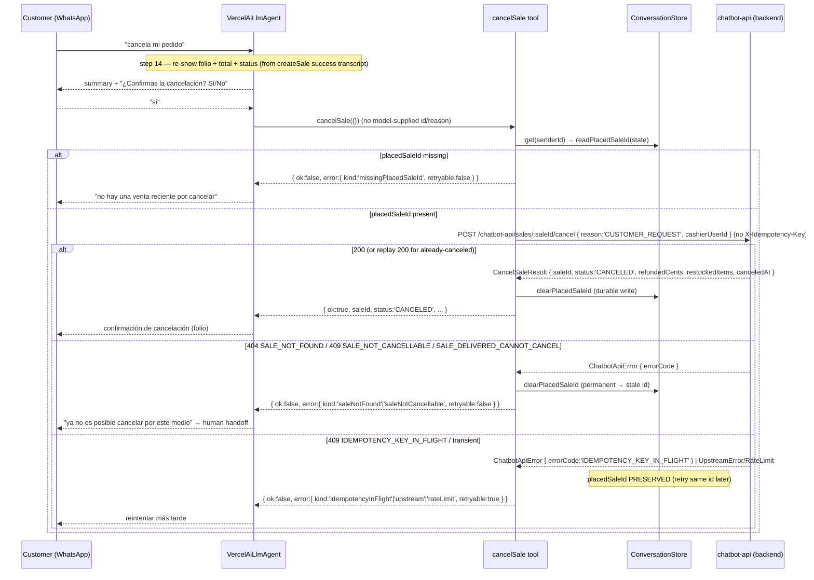

# Design: Conversational Cancel (`cancelSale` — 11th sale-flow tool)

## Technical Approach

Add a single AI-SDK tool `cancelSale` that unwinds the sale the bot **just confirmed**
in the current session. `createSale` already returns a `saleId`, but today it clears the
cart and drops the id; this slice makes that id durable (`data.placedSaleId`), reads it
back with zero model input, confirms with the customer, and calls the already-existing
backend `POST /chatbot-api/sales/:saleId/cancel`. The bot stays **consumer-only**: every
write flows through `ChatbotApiHttpClient`; the only persistence touched is the bot's own
`ConversationState.data` bag. No new packages, no env vars, no backend files.

Four structural changes:

1. **Durable `placedSaleId`.** `ConversationStateData` gains the typed optional
   `placedSaleId?: string`; `createSale` success persists `cart = EMPTY_CART` **and**
   `placedSaleId = sale.saleId` in one atomic write; `cancelSale` reads/clears it.
2. **Client contract.** `ChatbotApiClient.cancelSale(saleId, dto)` + `CancelSaleInput` /
   `CancelSaleInputSchema` / `CancelSaleResult` DTOs; HTTP POST with **no**
   `X-Idempotency-Key` header (idempotency is backend-derived `sale:cancel:<saleId>`).
3. **Error vocabulary.** Three new `ToolErrorKind` literals (`saleNotFound`,
   `saleNotCancellable`, `missingPlacedSaleId`); `mapChatbotError` stays pure and maps the
   two backend codes errorCode-first; the tool re-inspects `err.errorCode` for the state
   write (mirrors ADR-9).
4. **Prompt + contract suite.** `SALE_FLOW_INSTRUCTIONS` gains step 14 (cancel) and
   renumbers close 14 → 15; `tool-contract.spec.ts` `factories` repaired 9 → 11.

---

## Architecture Decisions (ADR-style)

| # | Decision | Choice | Rejected | Rationale |
|---|---|---|---|---|
| ADR-12 | **`placedSaleId` location** | Sibling key in `ConversationState.data` (`data.placedSaleId?: string`), **not** a `CartState` field | Add `saleId` to `CartState` | `CartState` is cart-*creation intent* (items, idempotencyKey, expectedTotalCents); a placed sale id is a post-confirmation *fact*. `data` is already an open `[key:string]: unknown` bag, so the type field is documentation only — no schema change, no migration. |
| ADR-13 | **Atomic success write** | One `ConversationStore.update` sets `data.cart = EMPTY_CART` **and** `data.placedSaleId = sale.saleId` | Two sequential `data`-replacing writes | `update` replaces the whole `data` bag; a second write would clobber the first's cart clear. One round-trip is the only correct ordering. |
| ADR-14 | **Helper module** | New `src/sale-flow/application/placed-sale-persistence.ts` (not folded into `cart-persistence.ts`) | Extend `cart-persistence.ts` | `cart-persistence` is cart-specific; `placedSaleId` is a sibling concern. `readPlacedSaleId` stays pure; `persistConfirmedSale`/`clearPlacedSaleId` are the only writers. |
| ADR-15 | **`cancelSale` id sourcing** | `inputSchema: z.object({}).strict()` + `contextSchema: { senderId }`; `execute` reads `readPlacedSaleId(state)` from durable state only | Model supplies `saleId`/`reason`/`cashierUserId` | The id/reason/cashier are all server/state-sourced; zero model ambiguity. `reason` fixed to `CUSTOMER_REQUEST`; `cashierUserId` injected from `deps.cashierUserId` (`CHATBOT_API_CASHIER_USER_ID`). |
| ADR-16 | **No client idempotency key** | `cancelSale` POST carries no `X-Idempotency-Key`; backend derives `sale:cancel:<saleId>` (SHA-256 of `{saleId, actorId, reason}`) | Reuse `createSale`'s client-minted UUID v4 | The backend derives the key; a client key would be ignored/wrong. Retry safety is server-side; the client-side `placedSaleId` clear after first success makes a second conversational attempt a `missingPlacedSaleId` no-op. |
| ADR-17 | **Mapper/tool split** | `mapChatbotError` stays pure (no store/senderId); `cancelSale` re-inspects `err.errorCode` in its `catch` to decide clear-vs-preserve | Fold state writes into `mapChatbotError` | Same rationale as ADR-9: the mapper has no store access; the tool owns the `placedSaleId` side effect. |
| ADR-18 | **Error-code state policy** | Permanent codes clear `placedSaleId`: `SALE_NOT_FOUND`, `SALE_NOT_CANCELLABLE`, `SALE_DELIVERED_CANNOT_CANCEL`, `IDEMPOTENCY_KEY_CONFLICT`; everything else (incl. unknown codes) preserves | Clear on any failure | Only the confirmed-permanent codes are provably unusable; unknown/future codes and status-fallback failures (`rateLimit`/`upstream`) are transient-ambiguous, so preserve to allow a same-id retry. |
| ADR-19 | **`CancelSaleResult` is its own DTO** | New `CancelSaleResult { saleId, status:'CANCELED', refundedCents, restockedItems, canceledAt }` | Reuse `BotSaleResponse` | The backend `cancelBotSale` returns `SalesService.cancelSale`'s `buildResult` projection — a different shape (no `folio`/`deliveryStatus`/`totalCents`). Deserializing as `BotSaleResponse` would be a lie. |
| ADR-20 | **Already-canceled = replay success** | A `CANCELED` sale resolves as 200 `status:'CANCELED'` (no error); tool treats it as success and clears the id | Invent an `alreadyCanceled` kind | The backend has no "already canceled" code; the model MAY surface the "ya estaba cancelada" nuance from the returned `status` but there is nothing to branch on. |
| ADR-21 | **`reason` enum width** | DTO declares all five enum values; only the tool hardcodes `CUSTOMER_REQUEST` | Tool accepts a `reason` input | Conversational cancel is always customer-initiated; the other four are operational/internal. Declaring the full enum keeps the wire contract complete with no churn if a future slice relaxes it. |

---

## Architecture Overview

No DI-graph change. `RealToolRegistry` already injects `CHATBOT_API_CLIENT`,
`CONVERSATION_STORE`, and `ConfigService`; `ToolDeps` already carries `cashierUserId`. The
new tool reuses the existing deps shape with no new provider or module binding.

```text
RealToolRegistry (deps: { chatbotApi, store, cashierUserId })
 ├─ createSale   (writes data.cart=EMPTY_CART AND data.placedSaleId on success)
 ├─ cancelSale   (reads data.placedSaleId → POST /sales/:id/cancel → clears on success/permanent)
 └─ … (9 existing tools unchanged)
```

---

## Sequence Diagram — cancel request



---

## File Map

### New (production)

| File | Responsibility |
|---|---|
| `src/sale-flow/application/placed-sale-persistence.ts` | `readPlacedSaleId` / `persistConfirmedSale` / `clearPlacedSaleId` |
| `src/sale-flow/application/tools/cancel-sale.tool.ts` | 11th AI-SDK tool factory `makeCancelSaleTool(deps)` |

### Modified (production)

| File | Change |
|---|---|
| `src/chatbot-api/domain/dtos/sales.dto.ts` | Add `CancelSaleInputSchema` (Zod), `CancelSaleInput`, `CancelSaleResult` |
| `src/chatbot-api/domain/chatbot-api.client.ts` | Port adds `cancelSale(saleId, dto): Promise<CancelSaleResult>` |
| `src/chatbot-api/infrastructure/chatbot-api-http.client.ts` | `cancelSale` POST `/sales/:id/cancel`, no idempotency header |
| `src/sale-flow/domain/tool-result.ts` | Add `saleNotFound`, `saleNotCancellable`, `missingPlacedSaleId`; update kind-count comment |
| `src/sale-flow/application/error-mapping.ts` | errorCode-first cases for the two cancel codes |
| `src/sale-flow/application/tools/create-sale.tool.ts` | Success path: `persistConfirmedSale` (atomic cart clear + placedSaleId) |
| `src/sale-flow/infrastructure/real-tool-registry.ts` | Register `cancelSale` (11th key); docstring 10 → 11 |
| `src/sale-flow/domain/sale-flow-instructions.ts` | Step 14 (cancel) + close renumbered 15 |
| `src/conversation/domain/conversation-store.ts` | `ConversationStateData.placedSaleId?: string` |

### Modified / new (tests — strict TDD)

| File | Change |
|---|---|
| `src/sale-flow/application/placed-sale-persistence.spec.ts` | **New** — read null/missing, atomic write, clear |
| `src/sale-flow/application/tools/cancel-sale.tool.spec.ts` | **New** — happy path, guard, fixed reason/cashier, error policy |
| `src/sale-flow/application/tools/create-sale.tool.spec.ts` | Success path asserts one atomic write sets `placedSaleId` + clears cart |
| `src/sale-flow/application/error-mapping.spec.ts` | 3 new errorCode-first cases + unknown-code fallback |
| `src/chatbot-api/infrastructure/chatbot-api-http.client.spec.ts` | `cancelSale` POST shape, no idempotency header, 200 projection, errorCode passthrough |
| `src/sale-flow/infrastructure/real-tool-registry.spec.ts` | Exactly 11 keys incl. `cancelSale`; stub `cancelSale` |
| `src/sale-flow/domain/sale-flow-instructions.spec.ts` | Step 14 + renumber 15; byte-identical confirm phrase |
| `src/sale-flow/application/tools/tool-contract.spec.ts` | `factories` 9 → 11 (adds `getPaymentDetails` + `cancelSale`) |

---

## Detailed Design

### a. DTOs (`sales.dto.ts`)

```ts
export const CancelSaleInputSchema = z.object({
  reason: z.enum([
    'CUSTOMER_REQUEST', 'ORDER_ERROR', 'OUT_OF_STOCK', 'DUPLICATE_SALE', 'OTHER',
  ]),
  cashierUserId: z.string().min(1),
});

export interface CancelSaleInput {
  reason: 'CUSTOMER_REQUEST' | 'ORDER_ERROR' | 'OUT_OF_STOCK' | 'DUPLICATE_SALE' | 'OTHER';
  cashierUserId: string;
}

export interface CancelSaleResult {
  saleId: string;
  status: 'CANCELED';
  refundedCents: number;
  restockedItems: Array<{ productId: string; variantId: string | null; quantity: number }>;
  canceledAt: string;
}
```

`CancelSaleResult` is a plain interface (matching existing response-DTO style — responses are
not Zod-validated today); only the input carries a Zod schema.

### b. Port + HTTP impl

Port (`chatbot-api.client.ts`) — add import of `CancelSaleInput`/`CancelSaleResult` and:

```ts
/** POST /chatbot-api/sales/:saleId/cancel (scope sales:write). No client
 *  X-Idempotency-Key — idempotency is backend-derived from sale:cancel:<saleId>. */
cancelSale(saleId: string, dto: CancelSaleInput): Promise<CancelSaleResult>;
```

HTTP (`chatbot-api-http.client.ts`):

```ts
cancelSale(saleId: string, dto: CancelSaleInput): Promise<CancelSaleResult> {
  const parsed = CancelSaleInputSchema.parse(dto);
  return this.request<CancelSaleResult>({
    method: 'POST',
    url: `/chatbot-api/sales/${encodeURIComponent(saleId)}/cancel`,
    data: { reason: parsed.reason, cashierUserId: parsed.cashierUserId },
  });
}
```

No `headers` key → `request()` applies only `Authorization` + `X-Branch-Id`; no
`X-Idempotency-Key` is sent (ADR-16). Errors surface `ChatbotApiError.errorCode` verbatim
via the existing `mapError`/`extractErrorCode` path — no change needed there.

### c. Error mapping (`tool-result.ts` + `error-mapping.ts`)

`ToolErrorKind` union gains `'saleNotFound' | 'saleNotCancellable' | 'missingPlacedSaleId'`
(all simple kinds — `SimpleToolError` picks them up via `Exclude<ToolErrorKind,'promoReQuote'>`).
Update the file header comment from "eleven kind literals / 10 simple kinds" to "fourteen /
13 simple kinds".

`mapChatbotError` switch gains (before the subclass/status fallback):

```ts
case 'SALE_NOT_FOUND':
  return { ok: false, error: { kind: 'saleNotFound', retryable: false } };
case 'SALE_NOT_CANCELLABLE':
case 'SALE_DELIVERED_CANNOT_CANCEL':
  return { ok: false, error: { kind: 'saleNotCancellable', retryable: false } };
```

`missingPlacedSaleId` is **never** emitted here — it is produced only by the tool's
client-side guard. Unknown cancel codes fall through to the existing status/subclass mapping
(404 → `notFound`, 403 → `forbidden`, 4xx → `validation`, 5xx → `upstream`).

### d. `placedSaleId` helpers (`placed-sale-persistence.ts`) + type

```ts
export function readPlacedSaleId(state: ConversationState | null): string | null {
  const raw = state?.data?.placedSaleId;
  return typeof raw === 'string' && raw.length > 0 ? raw : null;
}

export async function persistConfirmedSale(
  store: ConversationStore, senderId: string,
  state: ConversationState | null, saleId: string,
): Promise<ConversationState> {
  const lastMessageAt = state?.lastMessageAt ?? new Date().toISOString();
  const data = { ...(state?.data ?? {}), cart: EMPTY_CART, placedSaleId: saleId };
  return store.update(senderId, { lastMessageAt, data });
}

export async function clearPlacedSaleId(
  store: ConversationStore, senderId: string,
  state: ConversationState | null,
): Promise<ConversationState> {
  const lastMessageAt = state?.lastMessageAt ?? new Date().toISOString();
  const data = { ...(state?.data ?? {}) };
  delete data.placedSaleId;
  return store.update(senderId, { lastMessageAt, data });
}
```

`conversation-store.ts`:

```ts
export interface ConversationStateData {
  messages?: AgentMessage[];
  /** Sale id persisted by createSale success; read/cleared by cancelSale. */
  placedSaleId?: string;
  [key: string]: unknown;
}
```

### e. `cancelSale` tool (`cancel-sale.tool.ts`)

```ts
export function makeCancelSaleTool(deps: ToolDeps) {
  return tool({
    description:
      'Cancela SOLO la venta recién confirmada en esta sesión. Lee el id desde el estado durable (nunca desde el modelo ni desde getOrderHistory). reason siempre CUSTOMER_REQUEST y cashierUserId se inyecta del servidor.',
    inputSchema: z.object({}).strict(),
    contextSchema: z.object({ senderId: z.string() }),
    execute: async (_input, options) => {
      const senderId = options.context.senderId;
      const state = await deps.store.get(senderId);
      const placedSaleId = readPlacedSaleId(state);
      if (placedSaleId === null) {
        return { ok: false as const,
          error: { kind: 'missingPlacedSaleId' as const, retryable: false } };
      }
      try {
        const canceledSale = await deps.chatbotApi.cancelSale(placedSaleId, {
          reason: 'CUSTOMER_REQUEST', cashierUserId: deps.cashierUserId,
        });
        await clearPlacedSaleId(deps.store, senderId, state);
        return { ok: true as const, ...canceledSale };
      } catch (err) {
        if (err instanceof ChatbotApiError) {
          switch (err.errorCode) {
            case 'SALE_NOT_FOUND':
            case 'SALE_NOT_CANCELLABLE':
            case 'SALE_DELIVERED_CANNOT_CANCEL':
            case 'IDEMPOTENCY_KEY_CONFLICT':
              await clearPlacedSaleId(deps.store, senderId, state);
              break;
            default: // IDEMPOTENCY_KEY_IN_FLIGHT + transient/unknown → preserve
              break;
          }
        }
        return mapChatbotError(err);
      }
    },
  });
}
```

Return type is `ToolSuccess<CancelSaleResult>` (the `{ ok: true, ...canceledSale }` envelope);
the task's "CartSaleResult envelope" name is loose shorthand — no type named `CartSaleResult`
is introduced.

### f. `createSale` success-path atomic write

Replace `await persistCart(deps.store, senderId, state, EMPTY_CART); void EMPTY_CART;` with:

```ts
await persistConfirmedSale(deps.store, senderId, state, sale.saleId);
```

Drop the now-unused `persistCart` and `EMPTY_CART` imports; import `persistConfirmedSale`.
(`readCart`/`writeCart` and the `CartState` re-export stay.) `sale.saleId` is the top-level
`BotSaleResponse.saleId` — never a nested `sale.saleId` (spec shorthand `{ ok:true, sale:{...} }`
is imprecise; the tool spreads `...sale`).

### g. Registry (`real-tool-registry.ts`)

Add `import { makeCancelSaleTool }` and `cancelSale: makeCancelSaleTool(deps)` after
`getPaymentDetails`. Update the class docstring "ten sale-flow tools" → "eleven sale-flow
tools"; note `cancelSale` as the 11th key.

### h. Prompt (`sale-flow-instructions.ts`)

Insert step 14 and renumber the old step 14 → 15:

```text
14. Si el cliente pide cancelar su pedido ("cancela mi pedido", "me equivoqué"), cancela
    SOLO la venta que acabas de confirmar en esta sesión. NUNCA canceles ventas históricas ni
    de varias órdenes; NUNCA derives un `saleId` desde `getOrderHistory`. Muestra de nuevo el
    resumen de la venta (folio + total + estado, tomados del resultado exitoso de `createSale`
    en la transcripción actual) y pregunta EXACTAMENTE: "¿Confirmas la cancelación? Sí/No".
    Llama a `cancelSale` SOLO después de un "sí" explícito. Si devuelve
    `{ ok: false, error: { kind: 'saleNotCancellable' } }`, responde que ya no es posible
    cancelar por este medio y deriva a un agente humano. Si devuelve
    `{ ok: false, error: { kind: 'missingPlacedSaleId' } }`, responde
    `no hay una venta reciente por cancelar` — nunca inventes una venta por cancelar.

15. Cierra la conversación amablemente. No llames a `updateDelivery` (…).
```

The confirm phrase `¿Confirmas la cancelación? Sí/No` and the `missingPlacedSaleId` reply
`no hay una venta reciente por cancelar` are byte-identical assertion targets. Update the
header comment "14-step" → "15-step".

### i. Contract-suite repair (`tool-contract.spec.ts`)

Add imports for `makeGetPaymentDetailsTool` + `makeCancelSaleTool`; append
`['getPaymentDetails', makeGetPaymentDetailsTool as Factory]` and
`['cancelSale', makeCancelSaleTool as Factory]` to `factories` (9 → 11).

---

## TDD Plan (`rules.apply.tdd: true`)

Red-first, in dependency order (a red test either fails to compile or asserts a missing
symbol/behavior):

1. **Domain contracts**: `placed-sale-persistence.spec.ts` (module absent → red);
   `error-mapping.spec.ts` new cases (`saleNotFound`/`saleNotCancellable` literal not in
   union yet → compile red); `sale-flow-instructions.spec.ts` (step 14 absent → red).
2. **DTO/HTTP**: `chatbot-api-http.client.spec.ts` (`cancelSale` method absent → red;
   POST path/no-idempotency-header; 200 projection; `SALE_NOT_CANCELLABLE` errorCode
   passthrough).
3. **Tools**: `cancel-sale.tool.spec.ts` (module absent → red) — happy path, missing-id
   guard (no HTTP), fixed `reason`/`cashierUserId`, clear-on-permanent/preserve-on-transient;
   `create-sale.tool.spec.ts` success-path atomic write assertion (placedSaleId absent → red).
4. **Wiring**: `real-tool-registry.spec.ts` exactly-11 (currently 10 → red; add `cancelSale`
   to stub).
5. **Contract suite**: `tool-contract.spec.ts` 11 factories.

Green order mirrors red: implement DTO → port → HTTP → kinds → mapper → helpers →
`createSale` write → `cancelSale` tool → registry → prompt → contract suite. Gate:
`pnpm test`, `pnpm test:cov` ≥ 80% on changed files, `pnpm test:e2e`, `pnpm build`,
scoped `pnpm exec eslint src/sale-flow src/chatbot-api src/conversation`.

---

## Rollback Design

1. **Behaviour rollback** — remove the `cancelSale` key + import from `real-tool-registry.ts`;
   revert `create-sale.tool.ts` success write to `persistCart(…, EMPTY_CART)`; delete
   `cancel-sale.tool.ts` + `placed-sale-persistence.ts`. Cancellation requests fall through to
   the existing refusal phrase `esa función aún no está disponible` (or handoff). A leftover
   `data.placedSaleId` key is inert (no reader without the tool); `placedSaleId?: string` is
   optional, so the type change is backward-safe.
2. **Code rollback** — revert the delivery commit(s). Single-dev, no-PR delivery keeps each
   commit independently revertible; the archived `createSale`/`SALE_FLOW_INSTRUCTIONS` remain
   in git history.

---

## Budget & Commit Split

`design.md` is held to the 400-line budget (this doc). The **change** budget is the larger
risk: two new tools/modules + DTO + 8 modified files + ~8 spec files trend past 400 lines
mostly via tests. Recommended split:

- **Commit 1 — state + tool (runtime behaviour):** `conversation-store.ts`,
  `placed-sale-persistence.ts` (+spec), `create-sale.tool.ts` (+spec), `cancel-sale.tool.ts`
  (+spec), `tool-result.ts`, `error-mapping.ts` (+spec), `sales.dto.ts`, `chatbot-api.client.ts`,
  `chatbot-api-http.client.ts` (+spec), `real-tool-registry.ts` (+spec). End-to-end cancel
  works and all these tests are green.
- **Commit 2 — prompt + spec + contract-suite:** `sale-flow-instructions.ts` (+spec),
  `tool-contract.spec.ts` (9 → 11), `openspec/specs/sale-flow-tools/spec.md` and
  `openspec/specs/chatbot-api-client/spec.md` deltas (already authored), plus this `design.md`.

`tool-contract.spec.ts` may land in either commit; keep it in commit 2 so commit 1 stays
focused on runtime behaviour (it is a drift-repair, not a red test in commit 1).
