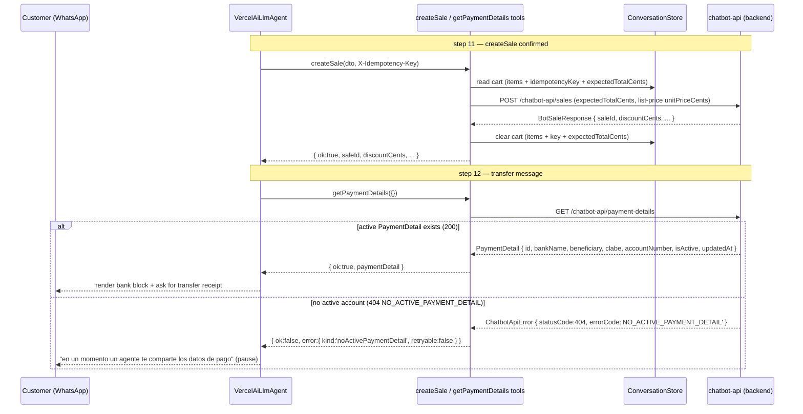
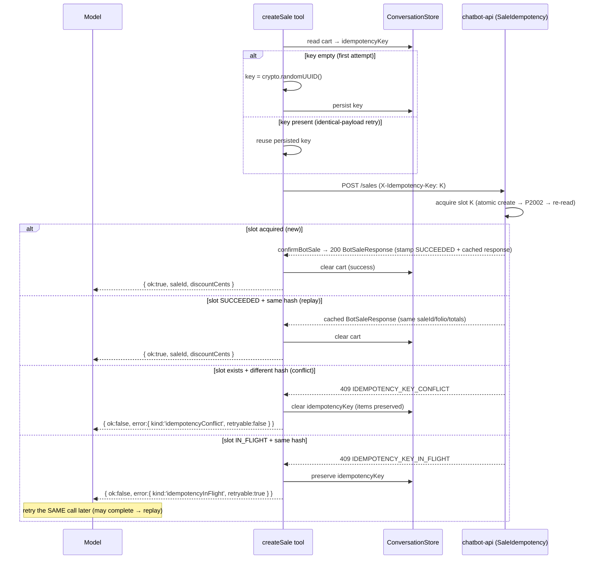
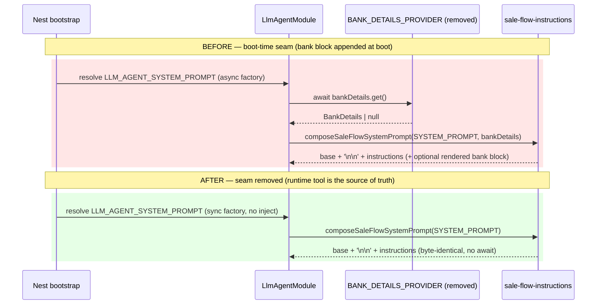

# Design: Sale Flow Contract Updates (Q1/Q2/Q3 bot-side)

## Technical Approach

Close the three blocked seams left by the archived `sale-flow` slice by honouring the
backend contract changes delivered in `chatbot-sale-flow-blockers` (2026-08-24). The bot is
**consumer-only**: every business write continues to flow through the `chatbot-api` HTTP
client; the only persistence this slice touches is its own per-sender
`ConversationState.data.cart` bag.

Four structural changes:

1. **Runtime bank-details tool (Q1/R11).** A new 10th AI-SDK tool `getPaymentDetails` wraps
   `GET /chatbot-api/payment-details`. The boot-time `BankDetailsProvider` port, its
   `NullBankDetailsProvider` impl, the `BANK_DETAILS_PROVIDER` module binding, and the
   `renderBankDetailsBlock` prompt append are **deleted**. `404 NO_ACTIVE_PAYMENT_DETAIL`
   becomes a new discriminated error kind `noActivePaymentDetail` that triggers the
   byte-identical human-handoff phrase already present in `SALE_FLOW_INSTRUCTIONS`.
2. **Promo `createSale` (Q2/R13).** `createSale` sends `expectedTotalCents` sourced from the
   cart, reads `discountCents` off the success response, and treats `409 PROMO_RE_QUOTE` as a
   normal re-confirmation flow (new key, cart preserved, idempotency key cleared).
3. **Atomic idempotency (Q3).** `ChatbotApiError` gains an `errorCode` passthrough; the
   tool-layer error mapper discriminates `errorCode` first and falls back to HTTP status only
   when `errorCode` is `null`; `createSale` branches on `IDEMPOTENCY_KEY_IN_FLIGHT` /
   `IDEMPOTENCY_KEY_CONFLICT` / `INVALID_IDEMPOTENCY_KEY` to preserve or clear the persisted key.
4. **Cart gains `expectedTotalCents`.** `evaluateCart` persists it; `createSale` reads it;
   legacy carts read `undefined` and omit the field on the wire.

No new packages, no env changes, no new tables, no backend code.

---

## Architecture Decisions (ADR-style)

| # | Decision | Choice | Rejected | Rationale |
|---|---|---|---|---|
| ADR-1 | **`errorCode` population point** | Add `errorCode: string \| null` as a 4th constructor param on `ChatbotApiError` (default `null`), populated explicitly by `ChatbotApiHttpClient.mapError` via a private `extractErrorCode(responseBody)` helper | A lazy getter that derives `errorCode` from `responseBody` on access | The spec says "`mapError` MUST read the parsed body's `error` field and assign it to `errorCode`". Explicit assignment keeps the null semantics testable at construction time and matches the wording. A getter is rejected only for being less explicit (it is behaviourally equivalent). |
| ADR-2 | **`errorCode` null semantics** | `errorCode === null` when (a) transport failed (no `responseBody`), (b) body is not a JSON object (Axios leaves it as a string), or (c) body has no string `error` field | Treat empty-string `error` as a code | "verbatim, no transformations" — a non-string or empty `error` is not a discriminable code, so it degrades to `null` and the legacy status mapping applies. |
| ADR-3 | **errorCode-first discrimination** | In `mapChatbotError`, switch on `err.errorCode` BEFORE the `instanceof Auth/Forbidden/NotFound/RateLimit` checks, and before the 4xx/5xx status fallback | Keep today's subclass-first order | `NO_ACTIVE_PAYMENT_DETAIL` is a 404 (would map `NotFoundError`→`notFound`) and `PROMO_RE_QUOTE` is a 409 (would map `UpstreamError(409)`→`validation`). errorCode must win or both new kinds are unreachable. |
| ADR-4 | **New `ToolErrorKind` literals** | Add `noActivePaymentDetail`, `promoReQuote`, `idempotencyInFlight`, `idempotencyConflict`, `priceOutOfDate` | Parse `message` strings | The backend envelope's `error` field is the contract; `message` is free-form and unstable. |
| ADR-5 | **`promoReQuote` payload shape** | Extend `ToolErrorResult.error` into a **discriminated union on `kind`**: a `SimpleToolError { kind, retryable }` for the 10 simple kinds plus a `PromoReQuoteToolError { kind:'promoReQuote', retryable:false, recomputedTotalCents, expectedTotalCents, discountCents }` | (a) optional fields on a flat error, or (b) a success-shaped `{ ok:false, ...payload }` envelope | See "ToolErrorResult shape" section. (a) lets a malformed `promoReQuote` (missing numbers) type-check; (b) contradicts the spec's exact `{ ok:false, error:{ kind:'promoReQuote', ... } }` shape and blurs the error/success contract the model learns. The union preserves the byte-exact two-field shape for the 10 other kinds (existing deep-equal scenarios stay green) while pinning the 3 numbers for `promoReQuote`. |
| ADR-6 | **`expectedTotalCents` sourcing** | `evaluateCart` computes `expectedTotalCents = Σ(finalPriceCents × quantity)` from the `evaluate-cart` response and persists it; `createSale` reads it from the cart and omits it on the wire when absent | Add a top-level `totalCents` to `CartEvaluationResult` (bot DTO) | `CartEvaluationResult` has **no** top-level `totalCents` (verified in `pricing.dto.ts`). The backend Q2 answer defines `expectedTotalCents` as "la suma de `finalPriceCents × quantity` de `evaluate-cart`". No backend change is permitted (read-only), and the backend does not return a top-level `totalCents` on `evaluate-cart`. See "expectedTotalCents sourcing" below. |
| ADR-7 | **List price still enforced per line** | `createSale` continues to send `unitPriceCents = originalPriceCents` (the persisted cart list price) per line; the promo total is carried **only** in the top-level `expectedTotalCents` guard | Send `finalPriceCents` per line | Backend Q2 keeps `PRICE_OUT_OF_DATE` (409): per-line `unitPriceCents` MUST equal the current list price; the promo engine re-evaluates server-side. The discounted total the bot quoted travels separately as `expectedTotalCents`. |
| ADR-8 | **Idempotency key rotation** | Mint on first attempt (`key === ''`); reuse on identical-payload retry; **clear** on success, `PROMO_RE_QUOTE`, `IDEMPOTENCY_KEY_CONFLICT`; **preserve** on `IDEMPOTENCY_KEY_IN_FLIGHT` and `PRICE_OUT_OF_DATE` / `INVALID_IDEMPOTENCY_KEY` | Server-side key generation | The backend keys on the header value; a client UUID v4 is stable across retries, and rotation on payload change is exactly the Q3 rule ("payload distinto → key nueva"). |
| ADR-9 | **Cart mutation vs. error mapping split** | `mapChatbotError` owns the error→envelope mapping; `createSale` owns the error→cart-mutation side effect, re-inspecting `err.errorCode` in its `catch` before calling `mapChatbotError` | Fold cart writes into `mapChatbotError` | `mapChatbotError` has no access to `store`/`senderId`/`cart`. Keeping the two concerns separate preserves `mapChatbotError`'s pure, dependency-free signature and keeps `createSale` the sole cart writer. |
| ADR-10 | **`getPaymentDetails` tool shape** | `inputSchema: z.object({})`, no `contextSchema` (no senderId), returns `{ ok:true, paymentDetail }` or the mapped error envelope | Inject bank data at boot | Fresh per-turn data is the only source of truth that survives admin changes/restarts without a cache-coherency problem (the root reason the boot seam is removed). |
| ADR-11 | **`discountCents` default** | `ChatbotApiHttpClient.createSale` normalizes `{ ...sale, discountCents: sale.discountCents ?? 0 }` and logs a one-time debug warning when the body omits it | Fail / leave undefined | Legacy backend responses omit the field; defaulting to `0` keeps the success envelope non-null and lets the model render the discount line only when `> 0`. |

---

## Architecture Overview

### DI graph (production, after seam removal)

```text
AppModule
 ├─ AppConfigModule.forRoot()          (global ConfigModule)
 ├─ ConversationModule ──► exports CONVERSATION_STORE
 ├─ ChatbotApiModule  ───► exports CHATBOT_API_CLIENT
 ├─ LlmAgentModule ─────► imports ConfigModule, ConversationModule, ChatbotApiModule, SaleFlowModule
 │    ├─ GENERATE_TEXT            (useValue: generateTextImpl)
 │    ├─ LLM_AGENT                (useFactory → VercelAiLlmAgent)
 │    ├─ TOOL_REGISTRY            (useExisting: RealToolRegistry)
 │    ├─ LLM_AGENT_SYSTEM_PROMPT  (sync useFactory: () => composeSaleFlowSystemPrompt(SYSTEM_PROMPT))
 │    ├─ CostGuardService
 │    └─ AgentRunner              (injects CONVERSATION_STORE, LLM_AGENT, TOOL_REGISTRY, CostGuardService,
 │                                 ConfigService, LLM_AGENT_SYSTEM_PROMPT)
 └─ WhatsappModule ──► injects AgentRunner into WebhookDispatcherService

SaleFlowModule
 ├─ imports ChatbotApiModule, ConversationModule
 ├─ providers:
 │    └─ RealToolRegistry  (injects CHATBOT_API_CLIENT, CONVERSATION_STORE, ConfigService)
 └─ exports: RealToolRegistry
```

`BANK_DETAILS_PROVIDER` no longer appears anywhere; `git grep BANK_DETAILS_PROVIDER` MUST return no
matches. `LLM_AGENT_SYSTEM_PROMPT` is now a **sync** factory with no `inject`.

---

## Sequence Diagrams

### 1. R11 — `createSale` OK → `getPaymentDetails` → transfer message (incl. 404 human-handoff)



### 2. R13 — `createSale` → `409 PROMO_RE_QUOTE` → re-confirm (and decline path)

```mermaid
sequenceDiagram
    participant C as Customer
    participant L as VercelAiLlmAgent
    participant T as createSale tool
    participant S as ConversationStore
    participant A as chatbot-api

    Note over L,A: first attempt with key K1, expectedTotalCents 1000
    L->>T: createSale(dto, K1)
    T->>S: read cart (idempotencyKey K1, expectedTotalCents 1000)
    T->>A: POST /chatbot-api/sales (X-Idempotency-Key: K1, expectedTotalCents: 1000)
    A-->>T: 409 { error:'PROMO_RE_QUOTE', recomputedTotalCents:900, expectedTotalCents:1000, discountCents:100 }
    T->>S: clear idempotencyKey ('' ) — PRESERVE items + expectedTotalCents
    T-->>L: { ok:false, error:{ kind:'promoReQuote', retryable:false, recomputedTotalCents:900, expectedTotalCents:1000, discountCents:100 } }
    L-->>C: "el nuevo total es $900 (descuento $100), ¿confirmas?"

    alt customer ACCEPTS
        C-->>L: "sí"
        L->>T: createSale(dto) — mint NEW key K2
        T->>S: idempotencyKey '' → mint crypto.randomUUID() (K2), persist
        T->>A: POST /chatbot-api/sales (X-Idempotency-Key: K2)
        A-->>T: BotSaleResponse { saleId, discountCents:100 }
        T->>S: clear cart
        T-->>L: { ok:true, saleId, discountCents:100 }
        L-->>C: confirmation + "Descuento aplicado: $100"
    else customer DECLINES
        C-->>L: "no"
        L->>L: do NOT re-emit createSale
        Note over S: cart items + expectedTotalCents preserved; idempotencyKey already ''
        L-->>C: offer alternatives (edit quantities / remove items / escalate)
    end
```

### 3. Q3 — idempotency state transitions from the tool's perspective



### 4. Boot-time prompt composition collapse (before / after)



---

## File Map

### Deleted

| File | Reason |
|---|---|
| `src/sale-flow/domain/bank-details.provider.ts` | Port + `BANK_DETAILS_PROVIDER` symbol removed (ADR-10). |
| `src/sale-flow/infrastructure/null-bank-details.provider.ts` | Null impl removed. |
| `src/sale-flow/infrastructure/null-bank-details.provider.spec.ts` | Test fixture removed. |

### Modified (production)

| File | Change |
|---|---|
| `src/chatbot-api/domain/errors.ts` | `ChatbotApiError` gains `errorCode: string \| null` (4th ctor param, default `null`); `RateLimitError` ctor forwards `errorCode`. |
| `src/chatbot-api/infrastructure/chatbot-api-http.client.ts` | `mapError` populates `errorCode` via `extractErrorCode`; add `getPaymentDetails()`; `createSale` validates `expectedTotalCents` (Zod), strips `null`/absent before send, defaults `discountCents` to `0`. |
| `src/chatbot-api/domain/chatbot-api.client.ts` | Port adds `getPaymentDetails(): Promise<PaymentDetail>`. |
| `src/chatbot-api/domain/dtos/sales.dto.ts` | `CreateSaleInput` + `expectedTotalCents?: number \| null`; `BotSaleResponse` + `discountCents: number`; add `CreateSaleInputSchema` (Zod). |
| `src/chatbot-api/domain/dtos/pricing.dto.ts` | **Unchanged** (no `totalCents` field — see ADR-6). |
| `src/sale-flow/domain/tool-result.ts` | 5 new `ToolErrorKind` literals; `error` becomes a discriminated union (ADR-5). |
| `src/sale-flow/domain/cart-state.ts` | `CartState.expectedTotalCents?: number`; `isCartState` accepts legacy carts (field absent). |
| `src/sale-flow/domain/sale-flow-instructions.ts` | Delete `BankDetails` type + `renderBankDetailsBlock`; `composeSaleFlowSystemPrompt(base)` (one arg); rewrite step 11 + step 12 literals. |
| `src/sale-flow/application/tool-deps.ts` | Drop `bankDetails: BankDetailsProvider` from `ToolDeps`. |
| `src/sale-flow/application/error-mapping.ts` | errorCode-first switch + 5 new kinds (ADR-3, ADR-4); `readPromoPayload` helper. |
| `src/sale-flow/application/tools/evaluate-cart.tool.ts` | Persist `expectedTotalCents` from `Σ(finalPriceCents × quantity)`; preserve existing `idempotencyKey`. |
| `src/sale-flow/application/tools/create-sale.tool.ts` | Send `expectedTotalCents` from cart; branch on `errorCode` for cart mutation; surface `discountCents`; success clears cart incl. optional field. |
| `src/sale-flow/infrastructure/real-tool-registry.ts` | Drop `@Inject(BANK_DETAILS_PROVIDER)`; register `getPaymentDetails` (10 tools). |
| `src/sale-flow/sale-flow.module.ts` | Drop `BANK_DETAILS_PROVIDER` binding + `NullBankDetailsProvider` import; export only `RealToolRegistry`. |
| `src/llm-agent/llm-agent.module.ts` | Drop `BANK_DETAILS_PROVIDER` import; `LLM_AGENT_SYSTEM_PROMPT` becomes sync `useFactory: () => composeSaleFlowSystemPrompt(SYSTEM_PROMPT)`. |

### New (production)

| File | Responsibility |
|---|---|
| `src/chatbot-api/domain/dtos/payment-details.dto.ts` | `PaymentDetail { id, bankName, beneficiary, clabe, accountNumber, isActive, updatedAt }` (bot-safe projection, no `tenantId`, no `createdAt`). |
| `src/sale-flow/application/tools/get-payment-details.tool.ts` | 10th AI-SDK tool factory (ADR-10). |
| `docs/provisioning-bot-cashier.md` | Q4 coordination checklist (bot cashier `User` + `ServiceCredential` with `payment-details:read` + the 6 existing scopes, one credential per branch). |

### Modified / new (tests — strict TDD)

| File | Change |
|---|---|
| `src/chatbot-api/infrastructure/chatbot-api-http.client.spec.ts` | `getPaymentDetails` GET + auth headers + 404/401/5xx; `createSale` forwards/omits/rejects `expectedTotalCents`; `BotSaleResponse.discountCents`; `errorCode` populated/null cases. |
| `src/sale-flow/application/error-mapping.spec.ts` | 5 new errorCode-first mappings + legacy `errorCode: null` fallback + `PROMO_RE_QUOTE` payload deep-equal. |
| `src/sale-flow/domain/cart-state.spec.ts` | `expectedTotalCents` round-trip; legacy cart (absent field) accepted; `readCart` default yields `expectedTotalCents: undefined`. |
| `src/sale-flow/application/tools/evaluate-cart.tool.spec.ts` | Persists `expectedTotalCents` from `Σ(finalPriceCents × quantity)`; preserves key. |
| `src/sale-flow/application/tools/create-sale.tool.spec.ts` | `expectedTotalCents` sourced from cart (never model input); 5 error-code branches + key clear/preserve; `discountCents` surfaced; success clears cart incl. optional field. |
| `src/sale-flow/application/tools/get-payment-details.tool.spec.ts` | **New** — 200 projection, 404 `noActivePaymentDetail`, empty inputSchema rejects unknown keys. |
| `src/sale-flow/infrastructure/real-tool-registry.spec.ts` | Exactly 10 keys incl. `getPaymentDetails`; no `BANK_DETAILS_PROVIDER` stub/injection. |
| `src/sale-flow/sale-flow.module.spec.ts` | `BANK_DETAILS_PROVIDER` not in providers; `RealToolRegistry` does not inject it; 10 keys. |
| `src/llm-agent/llm-agent.module.spec.ts` | `LLM_AGENT_SYSTEM_PROMPT` resolves to `SYSTEM_PROMPT + '\n\n' + SALE_FLOW_INSTRUCTIONS` byte-identical; 10 tools; no `await bankDetails.get()`. |
| `src/sale-flow/domain/sale-flow-instructions.spec.ts` | New signature (`composeSaleFlowSystemPrompt(base)`); delete `renderBankDetailsBlock`/`BankDetails` tests; add step-11 promo rule + step-12 gating assertions; add `getPaymentDetails` to marker-order. |
| `src/sale-flow/infrastructure/null-bank-details.provider.spec.ts` | **Deleted**. |

---

## `ChatbotApiError.errorCode` passthrough

### Population (in `mapError`)

```ts
// errors.ts
export class ChatbotApiError extends Error {
  constructor(
    message: string,
    public readonly statusCode: number | null,
    public readonly responseBody?: unknown,
    public readonly errorCode: string | null = null,
  ) {
    super(message);
    this.name = new.target.name;
  }
}

export class RateLimitError extends ChatbotApiError {
  constructor(
    retryAfterSeconds: number | null,
    responseBody?: unknown,
    errorCode: string | null = null,
  ) {
    super('Chatbot API rate limit exceeded', 429, responseBody, errorCode);
    this.retryAfterSeconds = retryAfterSeconds;
  }
  readonly retryAfterSeconds: number | null;
}
```

```ts
// chatbot-api-http.client.ts (private)
function extractErrorCode(body: unknown): string | null {
  if (typeof body !== 'object' || body === null) return null; // non-JSON → Axios leaves a string
  const error = (body as { error?: unknown }).error;
  return typeof error === 'string' && error.length > 0 ? error : null; // verbatim
}
```

`mapError` computes `const errorCode = extractErrorCode(responseBody)` once and passes it to every
constructed error (`AuthError`, `ForbiddenError`, `NotFoundError`, `RateLimitError`, both
`UpstreamError` branches). Subclasses with no own constructor inherit the base 4-arg constructor.

### Null semantics (pinned)

| Case | `errorCode` |
|---|---|
| Transport failure (no `responseBody`) | `null` |
| Body is not JSON (Axios leaves a string) | `null` |
| Body has no `error` field / `error` is not a string / empty string | `null` |
| JSON body with string `error` field | the string verbatim |

### errorCode-first discrimination (`mapChatbotError`)

The new mapper switches on `errorCode` **before** any subclass/status check, so a
`NO_ACTIVE_PAYMENT_DETAIL` (404 → `NotFoundError`) yields `noActivePaymentDetail`, and a
`PROMO_RE_QUOTE` (409 → `UpstreamError(409)`) yields `promoReQuote`, never `notFound`/`validation`.

```ts
export function mapChatbotError(err: unknown): ToolErrorResult {
  if (err instanceof ChatbotApiError) {
    switch (err.errorCode) {
      case 'PROMO_RE_QUOTE': {
        const p = readPromoPayload(err);          // numeric {recomputedTotalCents, expectedTotalCents, discountCents}
        if (p) return { ok:false, error: { kind:'promoReQuote', retryable:false, ...p } };
        break;                                    // malformed payload → fall through to status mapping
      }
      case 'NO_ACTIVE_PAYMENT_DETAIL': return { ok:false, error: { kind:'noActivePaymentDetail', retryable:false } };
      case 'IDEMPOTENCY_KEY_IN_FLIGHT':  return { ok:false, error: { kind:'idempotencyInFlight',  retryable:true  } };
      case 'IDEMPOTENCY_KEY_CONFLICT':    return { ok:false, error: { kind:'idempotencyConflict', retryable:false } };
      case 'PRICE_OUT_OF_DATE':           return { ok:false, error: { kind:'priceOutOfDate',      retryable:false } };
      case 'INVALID_IDEMPOTENCY_KEY':     return { ok:false, error: { kind:'validation',          retryable:false } };
      default: break;
    }
    // status/subclass fallback (legacy backend without errorCode)
    if (err instanceof AuthError)       return { ok:false, error: { kind:'auth',      retryable:false } };
    if (err instanceof ForbiddenError)  return { ok:false, error: { kind:'forbidden', retryable:false } };
    if (err instanceof NotFoundError)   return { ok:false, error: { kind:'notFound',  retryable:false } };
    if (err instanceof RateLimitError)  return { ok:false, error: { kind:'rateLimit', retryable:true  } };
    const status = err.statusCode;
    if (typeof status === 'number' && status >= 400 && status < 500) {
      return { ok:false, error: { kind:'validation', retryable:false } };  // legacy 400/422, PRICE_OUT_OF_DATE w/o code
    }
    return { ok:false, error: { kind:'upstream', retryable:true } };       // 5xx / network
  }
  throw err;  // BranchMismatchError / store failure — infra defect, propagate
}
```

`readPromoPayload` defensively reads `recomputedTotalCents` / `expectedTotalCents` /
`discountCents` off `err.responseBody`, requiring non-negative integers; a missing/malformed field
returns `null` so the mapper falls back to the status path instead of fabricating numbers.

---

## `ToolErrorResult` shape (ADR-5)

```ts
export type ToolErrorKind =
  | 'auth' | 'forbidden' | 'notFound' | 'rateLimit' | 'upstream' | 'validation'
  | 'noActivePaymentDetail' | 'promoReQuote' | 'idempotencyInFlight'
  | 'idempotencyConflict' | 'priceOutOfDate';

export interface SimpleToolError {
  kind: Exclude<ToolErrorKind, 'promoReQuote'>;
  retryable: boolean;
}

export interface PromoReQuoteToolError {
  kind: 'promoReQuote';
  retryable: false;
  recomputedTotalCents: number;
  expectedTotalCents: number;
  discountCents: number;
}

export type ToolError = SimpleToolError | PromoReQuoteToolError;

export interface ToolErrorResult {
  ok: false;
  error: ToolError;
}

export type ToolSuccess<T> = { ok: true } & T;
export type ToolResult<T> = ToolSuccess<T> | ToolErrorResult;
```

The spec's `{ ok:false, error:{ kind:'promoReQuote', retryable:false, recomputedTotalCents,
expectedTotalCents, discountCents } }` deep-equals `PromoReQuoteToolError`. The other ten kinds keep
the exact `{ kind, retryable }` two-field shape, so every existing deep-equal scenario remains valid.

---

## `expectedTotalCents` sourcing

- **Writer** (`evaluate-cart.tool.ts`): after `chatbotApi.evaluateCart(items)` resolves, compute
  `expectedTotalCents = evaluation.items.reduce((sum, i) => sum + i.finalPriceCents * i.quantity, 0)`
  and persist it on the cart alongside the existing `items` (list price) and preserved
  `idempotencyKey`. The value is the discounted total the bot quotes at step 8 — never a model input.
- **Reader** (`create-sale.tool.ts`): `const dto = { ..., ...(cart.expectedTotalCents !== undefined ? { expectedTotalCents: cart.expectedTotalCents } : {}) }`.
  Legacy carts (`undefined`) omit the key entirely — never `0`, never `null`.
- **Wire** (`chatbot-api-http.client.ts`): validate with `CreateSaleInputSchema` (`.int().min(0).nullish()`),
  then strip `null`/`undefined` before send so the JSON body never carries the key when absent.
- **Re-evaluation invariant (prompt-pinned)**: step 8 requires `evaluateCart` before confirmation;
  any cart mutation re-runs `evaluateCart` before `createSale`. If that invariant is violated the
  stale `expectedTotalCents` simply triggers `PROMO_RE_QUOTE` (safe fallback, no bad sale).
- **`needs_human_review`**: `evaluateCart` still persists `expectedTotalCents` on every success, but
  the prompt's step-11 rule routes `needs_human_review` to human review, so `createSale` is not
  called in that branch.

---

## `createSale` + idempotency (new flow)

```ts
// inside makeCreateSaleTool.execute
// 1) read cart, empty-cart guard (unchanged)
// 2) mint/reuse idempotencyKey (unchanged)
// 3) list-price enforcement per line (unchanged): unitPriceCents = cart.unitPriceCents
// 4) build dto incl. expectedTotalCents only when cart.expectedTotalCents !== undefined
try {
  const sale = await deps.chatbotApi.createSale(dto, idempotencyKey);
  await persistCart(deps.store, senderId, state, EMPTY_CART);   // { items:[], idempotencyKey:'' }
  return { ok: true, ...sale };                                  // sale.discountCents now present
} catch (err) {
  if (err instanceof ChatbotApiError) {
    switch (err.errorCode) {
      case 'PROMO_RE_QUOTE':
        await persistCart(deps.store, senderId, state, {
          ...cart, idempotencyKey: '',                 // preserve items + expectedTotalCents
        });
        break;
      case 'IDEMPOTENCY_KEY_CONFLICT':
        await persistCart(deps.store, senderId, state, {
          ...cart, idempotencyKey: '',                 // preserve items + expectedTotalCents
        });
        break;
      case 'IDEMPOTENCY_KEY_IN_FLIGHT':
        break;                                          // preserve everything — retry same key later
      case 'PRICE_OUT_OF_DATE':
      case 'INVALID_IDEMPOTENCY_KEY':
        break;                                          // preserve key (defensive)
      default:
        break;
    }
  }
  return mapChatbotError(err);                          // builds the correct envelope (ADR-9)
}
```

Key lifecycle summary (matches spec table):

| Outcome | `kind` | `retryable` | items | `idempotencyKey` | `discountCents` surfaced |
|---|---|---|---|---|---|
| success | — | — | cleared | cleared | yes (success envelope) |
| `PROMO_RE_QUOTE` (409) | `promoReQuote` | false | preserved | **cleared** | yes (error envelope) |
| `IDEMPOTENCY_KEY_IN_FLIGHT` (409) | `idempotencyInFlight` | true | preserved | **preserved** | n/a |
| `IDEMPOTENCY_KEY_CONFLICT` (409) | `idempotencyConflict` | false | preserved | **cleared** | n/a |
| `PRICE_OUT_OF_DATE` (409) | `priceOutOfDate` | false | preserved | preserved | n/a |
| `INVALID_IDEMPOTENCY_KEY` (400) | `validation` | false | preserved | preserved | n/a |

`EMPTY_CART` remains `{ items: [], idempotencyKey: '' }` (the optional `expectedTotalCents` is simply
absent). `readCart` yields `expectedTotalCents: undefined` by absence, which the spec's
"cleared cart deep-equals `{ items: [], idempotencyKey: '', expectedTotalCents: undefined }`" treats
as equivalent under Jest `toEqual` (undefined keys are ignored).

---

## `getPaymentDetails` tool

```ts
export function makeGetPaymentDetailsTool(deps: ToolDeps) {
  return tool({
    description:
      'Obtiene los datos bancarios activos para la transferencia. Llama SOLO después de que createSale devuelva ok:true, exactamente una vez por venta confirmada.',
    inputSchema: z.object({}),          // z.object({}), NOT .passthrough() — unknown keys rejected
    execute: async () => {
      try {
        const paymentDetail = await deps.chatbotApi.getPaymentDetails();
        return { ok: true as const, paymentDetail };
      } catch (err) {
        return mapChatbotError(err);
      }
    },
  });
}
```

No `contextSchema` (no senderId needed). The HTTP method:

```ts
getPaymentDetails(): Promise<PaymentDetail> {
  return this.request<PaymentDetail>(
    { method: 'GET', url: '/chatbot-api/payment-details' },
    { retryable: true },   // idempotent GET — retry with backoff
  );
}
```

`PaymentDetail` is a plain interface (matching existing response-DTO style; responses are not Zod
validated today) with exactly `{ id, bankName, beneficiary, clabe, accountNumber, isActive, updatedAt }`
and no `tenantId`/`createdAt`.

---

## Prompt composition + step-11/step-12 literal changes

### Composer collapse

```ts
export function composeSaleFlowSystemPrompt(base: string): string {
  return base + '\n\n' + SALE_FLOW_INSTRUCTIONS;
}
```

`renderBankDetailsBlock` and the `BankDetails` type are deleted. The `LLM_AGENT_SYSTEM_PROMPT`
factory in `llm-agent.module.ts` becomes a **sync** `useFactory: () =>
composeSaleFlowSystemPrompt(SYSTEM_PROMPT)` with no `inject` and no `await`.

### Step 11 — exact replacement

```text
11. Llama a `createSale` pasando `expectedTotalCents` desde el carrito (el total que le mostraste al cliente en el paso 8). Reglas:
    - Pasa `unitPriceCents = originalPriceCents` para cada línea (NUNCA `finalPriceCents`). El backend re-evalúa las promociones server-side.
    - Si `evaluateCart` devolvió `promotionEvaluationStatus === 'needs_human_review'`, NO registres la venta: deriva a revisión humana.
    - Si `createSale` devuelve `{ ok: false, error: { kind: 'promoReQuote', recomputedTotalCents, expectedTotalCents, discountCents } }`, es flujo normal (no un error): muestra al cliente el nuevo total `recomputedTotalCents`, pide confirmación EXPLÍCITA y, si acepta, re-emite `createSale` con una `X-Idempotency-Key` NUEVA (UUID v4). NUNCA reutilices la key anterior después de un `promoReQuote`.
```

### Step 12 — exact replacement

```text
12. Mensaje de datos bancarios (solo si `createSale` tuvo éxito):
    - Llama a `getPaymentDetails` después de que `createSale` confirme (devuelva `ok: true`), exactamente una vez por venta confirmada. NUNCA llames a `getPaymentDetails` antes de que `createSale` confirme una venta.
    - Si `getPaymentDetails` devuelve `{ ok: false, error: { kind: 'noActivePaymentDetail' } }`, responde EXACTAMENTE: "en un momento un agente te comparte los datos de pago" y pausa. No continúes hasta que un humano te indique los datos por otro canal.
    - Si `getPaymentDetails` devuelve `{ ok: true, paymentDetail: {...} }`, reléyale al cliente EXACTAMENTE los datos devueltos (`bankName`, `beneficiary`, `clabe`, `accountNumber`) y pídele que envíe su comprobante de transferencia (imagen o captura).
    - **Nunca** inventes un banco, beneficiario, CLABE o número de cuenta. Esos datos solo los devuelve `getPaymentDetails`.
```

The human-handoff phrase `en un momento un agente te comparte los datos de pago` is **byte-identical**
(unchanged), now wrapped in the `noActivePaymentDetail` branch. The gating rule substring
`Llama a \`getPaymentDetails\` después de que \`createSale\` confirme` is present verbatim.

### `sale-flow-instructions.spec.ts` impact

- `composeSaleFlowSystemPrompt(base, null)` → `composeSaleFlowSystemPrompt(base)` (one arg).
- **Delete** the `renderBankDetailsBlock` `describe` and the `BankDetails` import/type fixtures.
- **Delete** the "appends a rendered bank block" and "composed prompt with BankDetails still
  contains..." tests (the seam is gone).
- **Update** the marker-order test to include `getPaymentDetails` between `createSale` and
  `attachReceipt`.
- **Add** assertions: step-12 gating rule present; human-handoff phrase is inside a
  `noActivePaymentDetail` branch; step-11 `promoReQuote` re-confirmation rule present.
- **Keep** the "contains the literal refusal phrase", "forbidden-slang block", "14-step markers",
  and "human-handoff phrase" assertions (all still true).

---

## `discountCents` surfacing

- **Success path**: `BotSaleResponse.discountCents` (defaulted to `0` by the HTTP client) flows
  through `{ ok: true, ...sale }`. The model renders `Descuento aplicado: $X` only when
  `discountCents > 0`; when `=== 0` the line is omitted (step-11/confirmation guidance in the
  literal). The value is the FINAL `createSale` response's `discountCents` — never estimated from
  `evaluateCart`.
- **`PROMO_RE_QUOTE` path**: the error envelope's `discountCents` (with `recomputedTotalCents` and
  `expectedTotalCents`) lets the model show the re-quoted total before re-confirmation.
- The bot never computes `discountCents` itself; it only relays the backend number.

---

## Seam-removal migration map (exact list)

Delete:

1. `src/sale-flow/domain/bank-details.provider.ts`
2. `src/sale-flow/infrastructure/null-bank-details.provider.ts`
3. `src/sale-flow/infrastructure/null-bank-details.provider.spec.ts`

Modify (remove every `BANK_DETAILS_PROVIDER` / `BankDetailsProvider` / `bankDetails` / `BankDetails` /
`renderBankDetailsBlock` reference):

4. `src/sale-flow/application/tool-deps.ts` — drop `bankDetails`.
5. `src/sale-flow/infrastructure/real-tool-registry.ts` — drop `@Inject(BANK_DETAILS_PROVIDER)` +
   import; keep `ConfigService` for `cashierUserId`.
6. `src/sale-flow/sale-flow.module.ts` — drop binding + import; export only `RealToolRegistry`.
7. `src/llm-agent/llm-agent.module.ts` — drop import; collapse `LLM_AGENT_SYSTEM_PROMPT` factory.
8. `src/sale-flow/domain/sale-flow-instructions.ts` — drop `BankDetails` type +
   `renderBankDetailsBlock` + `bankDetails` param.
9. `src/sale-flow/domain/sale-flow-instructions.spec.ts` — drop `BankDetails`/`renderBankDetailsBlock`
   fixtures; one-arg composer.
10. `src/sale-flow/infrastructure/real-tool-registry.spec.ts` — drop `BANK_DETAILS_PROVIDER` stub +
    injection.
11. `src/sale-flow/sale-flow.module.spec.ts` — drop `NullBankDetailsProvider`/`BANK_DETAILS_PROVIDER`
    assertions.
12. `src/llm-agent/llm-agent.module.spec.ts` — assert sync factory + byte-identical prompt + 10 tools.

Acceptance gate: `git grep -n 'BANK_DETAILS_PROVIDER\|BankDetailsProvider\|bankDetails\|renderBankDetailsBlock' src/`
returns no matches (except history in git, none in working tree).

---

## Testing Strategy (strict TDD)

Order (red → green → refactor):

1. **Domain contracts first**: `cart-state.spec.ts` (`expectedTotalCents` round-trip + legacy guard),
   `error-mapping.spec.ts` (errorCode-first table + payload + fallback),
   `sale-flow-instructions.spec.ts` (one-arg composer + step-11/step-12 assertions + deleted seam).
2. **DTO/HTTP client**: `chatbot-api-http.client.spec.ts` (`errorCode` population/null semantics,
   `getPaymentDetails` GET + headers + 404/401/5xx, `createSale` forward/omit/reject
   `expectedTotalCents`, `discountCents` default).
3. **Tools**: `evaluate-cart.tool.spec.ts` (persist `expectedTotalCents`), `create-sale.tool.spec.ts`
   (5 error-code branches + key rotation + `discountCents`), `get-payment-details.tool.spec.ts`
   (new: 200 projection / 404 kind / empty schema).
4. **Wiring**: `real-tool-registry.spec.ts` (10 keys, no `BANK_DETAILS_PROVIDER`),
   `sale-flow.module.spec.ts` (no binding), `llm-agent.module.spec.ts` (byte-identical prompt, 10 tools).
5. `pnpm test:cov` ≥ 80% on changed files; `pnpm test:e2e` green; scoped lint
   `pnpm exec eslint src/sale-flow src/chatbot-api src/llm-agent`.

Coverage note: the five new error-code branches, the `expectedTotalCents` round-trip, the key
clear/preserve matrix, and the deleted-seam negative assertions are the highest-value red tests.

---

## Rollback Design

Both proposal rollback paths map to concrete reverts. Because the backend contract is already merged,
a partial rollback degrades safely to the archived "list-price only + human-handoff" behaviour.

### 1. Behaviour rollback (restore the seam, keep the new tool inert)

- Re-add `bank-details.provider.ts` + `null-bank-details.provider.ts`; restore `BANK_DETAILS_PROVIDER`
  binding in `sale-flow.module.ts`; restore `composeSaleFlowSystemPrompt(base, bankDetails)` and
  `renderBankDetailsBlock`; restore the `bankDetails` field in `ToolDeps` and the
  `@Inject(BANK_DETAILS_PROVIDER)` param in `RealToolRegistry`; restore the async
  `LLM_AGENT_SYSTEM_PROMPT` factory with `await bankDetails.get()`.
- Revert `createSale` (no `expectedTotalCents`, no `PROMO_RE_QUOTE` branch, no `errorCode`
  discrimination) and revert `evaluateCart` (no `expectedTotalCents` persistence).
- **Keep** `getPaymentDetails` registered but revert step 12 to the archived human-handoff branch.
- Net effect: R11 falls back to "wait for human"; R13 sells at list price only; idempotency reverts
  to the relaxed archived contract. No data loss (`expectedTotalCents` is optional and ignored).

### 2. Code rollback (revert the merge commit)

- Single-PR delivery keeps the revert to one commit. The archived
  `composeSaleFlowSystemPrompt`/`NullBankDetailsProvider`/list-price `createSale` remain in git
  history; git tracks renames so no destructive delete is required.

---

## Risks & Open Questions

| # | Risk / question | Mitigation |
|---|---|---|
| R-D1 | **`CartEvaluationResult` has no top-level `totalCents`**; the spec scenario shorthand (`evaluateCart returned totalCents: 1500`) differs from the actual DTO. | ADR-6 computes `expectedTotalCents = Σ(finalPriceCents × quantity)` per the backend Q2 answer. Verify against the sandbox at apply time; if the backend ever adds a top-level `totalCents`, adopt it and drop the client-side sum (tool contract unchanged). |
| R-D2 | **`PROMO_RE_QUOTE` payload missing/malformed** in the error body. | `readPromoPayload` returns `null` → status fallback; spec deep-equal only for well-formed bodies. |
| R-D3 | **Legacy backend without `errorCode`** maps 409/422 to `validation` (safe degradation). | errorCode-first switch falls through to the existing status mapping; pinned by the "legacy backend" scenario. |
| R-D4 | **`expectedTotalCents` drift** after a cart edit between `evaluateCart` and `createSale`. | Prompt-pinned re-evaluation invariant (step 8); stale value safely triggers `PROMO_RE_QUOTE`, not a bad sale. |
| R-D5 | **`discountCents` legacy omission** (old backend). | HTTP client defaults to `0` + one-time debug log. |
| R-D6 | **`getPaymentDetails` called before `createSale`** by a misbehaving model. | Prompt gating only (tool itself does not gate); pinned by the step-12 scenario. |

---

## Success Criteria (design-level)

- 10 tools registered (`getPaymentDetails` is the 10th key); `git grep BANK_DETAILS_PROVIDER` → none.
- `LLM_AGENT_SYSTEM_PROMPT` = `SYSTEM_PROMPT + '\n\n' + SALE_FLOW_INSTRUCTIONS` byte-identical, sync factory.
- `CartState.expectedTotalCents?: number` round-trips `evaluateCart → cart → createSale → wire`; legacy carts omit the key.
- `ChatbotApiError.errorCode` populated in `mapError`; `null` only on transport fail / non-JSON / no `error` field.
- `error-mapping.ts` maps the 5 new kinds errorCode-first; `createSale` wires the key clear/preserve matrix.
- `BotSaleResponse.discountCents` surfaced on success; `promoReQuote` error carries the 3 numeric fields.
- `pnpm test` + `pnpm test:e2e` green; `pnpm build` clean; scoped lint passes.
