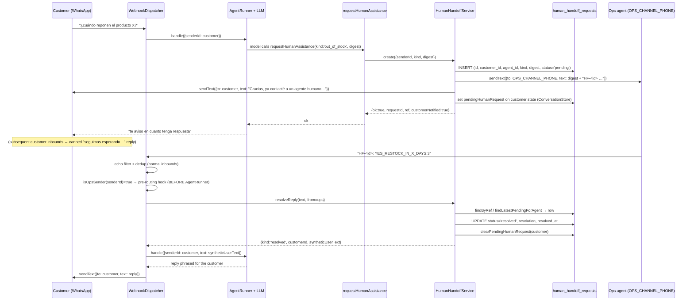

# Design: human-handoff (async bot ↔ human request/response channel)

## Summary

Give the three owner-mandated human-in-the-loop flows (R7 out-of-stock, the
`needs_human_review` promo branch, R14 expiration dates) a **real mechanism**
instead of LLM-phrased prompt text. The bot writes a durable `human_handoff_requests`
row, sends a `HF-<id>` digest to a human agent's WhatsApp number
(`OPS_CHANNEL_PHONE`), sends the customer a one-shot "under review" notice, then
**waits** (no scheduler, no expiry) until the agent replies on that thread. The reply
is correlated by ref token, persisted as a per-kind `resolution`, and re-injected as a
synthetic user turn so the customer's next LLM turn resumes the flow.

This is the **foundation slice**: R7 + `needs_human_review` + R14 wire in now; R6
(shipping-quote approval) drops into the same channel later without restructuring.

Verified current shapes (before designing, read from `src/`):
- `ConversationState.data` is an open JSONB bag with `messages`/`cart`/`placedSaleId`.
- `AgentRunner.handle` currently writes `data: { messages: nextTurns }` — it **replaces**
  the whole bag on every turn (this must change; see ADR-28).
- `normalizeInboundMessages` is a **private inline function** in
  `webhook-dispatcher.service.ts` (there is no `normalize-inbound-messages.ts`); it
  captures only `message.from` + `message.text.body`.
- `WebhookValueDto` has **no `metadata` field** today — the receiving
  `value.metadata.phone_number_id` is NOT currently parsed.
- Migrations are `.js` `node-pg-migrate` files (`1700000000000_…`, `1800000000000_…`),
  not `.ts`/`.sql` — the new migration follows that exact convention.

---

## Architecture Decisions (ADR-22 → ADR-33)

| # | Decision | Choice | Rejected | Rationale |
|---|---|---|---|---|
| ADR-22 | **Ops-side classification key** | `senderId` (`message.from`) compared to `OPS_CHANNEL_PHONE`, both run through `normalizeSandboxRecipient()` | `metadata.phone_number_id === ops number` as the discriminator | The owner decision is ONE bot number + the agent's personal wa_id as `OPS_CHANNEL_PHONE`. The bot sends the digest *from* its single number *to* the agent; the agent replies *to* the same bot number. Therefore `metadata.phone_number_id` is always `META_PHONE_NUMBER_ID` for both customer and ops inbounds and cannot discriminate. `message.from` is the unambiguous "who is this" signal. The trunk-`1` sandbox caveat is neutralised by normalising BOTH sides. |
| ADR-23 | **Capture receiving number anyway** | Extend `WebhookValueDto.metadata` → `InboundMessage.receivingPhoneNumberId?: string` | Skip metadata entirely | Cheap, defensive, and future-proofs a multi-number slice; it is logged for observability and asserted equal to the bot's own number, but is NOT the routing discriminator in this slice. Resolves proposal Open Question 1: the payload shape is `value.metadata.phone_number_id` (and `display_phone_number`), currently unparsed. |
| ADR-24 | **`agent_id` is set at create** | `agent_id text NOT NULL` = `OPS_CHANNEL_PHONE` at create; `findLatestPendingForAgent(agentId)` filters `agent_id = $1 AND status='pending' ORDER BY created_at DESC LIMIT 1` | `agent_id` nullable, filled "once they reply" | The proposal's own port method (`findLatestPendingForAgent`) requires the agent to be known *before* resolution. There is exactly one ops recipient, so the agent is known at create. A single pending request per agent keeps the no-token fallback unambiguous. |
| ADR-25 | **id / ref representation** | `id` = 12 lowercase hex chars from `crypto.randomUUID().replace(/-/g,'').slice(0,12)`; human-facing `ref = 'HF-' + id`; parser regex `/\bHF-([A-Za-z0-9_-]{4,32})\b/i` | full 36-char UUID as `id` | A full UUID exceeds the `{4,32}` ref token budget the proposal pins; 12 hex chars (≈2.8e14 space) is ample and keeps the token short enough to copy-paste. |
| ADR-26 | **Digest/resolution shape** | `kind` column (text) + `digest jsonb` = per-kind payload; `resolution jsonb` = discriminated union | one flat digest object with optional-everything | Per-kind Zod-validated payloads (`out_of_stock` / `needs_human_review` / `expiration_date`) keep the model from inventing fields and keep `requestHumanAssistance` the single write path. |
| ADR-27 | **Tool/trigger split** | `requestHumanAssistance` is the ONLY entry point; `check-stock`/`evaluate-cart` return a **signal** `humanAssistance` envelope, the model decides to call the tool | trigger tools call the handoff service directly | Extends ADR-9 (the tool owns the row; the mapper/tool split keeps side effects out of read-only trigger tools). The model stays in control of *whether* to escalate (matches "the model still renders the quote and only escalates if the customer wants to proceed"). |
| ADR-28 | **`AgentRunner` final write merges fresh state** | After `llm.run`, re-`get` the state and persist `data: { ...freshState.data, messages: nextTurns }` | spread the pre-`llm.run` `state.data` | The handoff marker (and today `cart`/`placedSaleId`) are written *during* `llm.run` by tools; the runner's current `data: { messages }` write clobbers them. Re-reading after `llm.run` is the minimal correct fix and makes `pendingHumanRequest` exempt from the idle wipe without a special-case patch. |
| ADR-29 | **Short-circuit semantics** | While `pendingHumanRequest` is set, `AgentRunner` returns the canned reply with **no** store write, **no** `costGuard.record`, **no** `llm.run` | still run the LLM but nudge | The marker is the machine state; running the model would both cost tokens and bloat the transcript. The canned reply is byte-identical and deterministic. |
| ADR-30 | **Module wiring** | Extract a leaf `WhatsappSenderModule` providing `WHATSAPP_SENDER → MetaWhatsappSender`; both `WhatsappModule` and `HumanHandoffModule` import it | `forwardRef` between `WhatsappModule` ↔ `HumanHandoffModule` | The dispatcher needs `HumanHandoffService`; the service needs `WHATSAPP_SENDER`. Extracting the sender breaks the cycle with a plain acyclic graph (no `forwardRef` anywhere in the repo today). |
| ADR-31 | **Resolution injection = synthetic turn through the runner** | `resolveReply` clears the marker, returns `syntheticUserText`; the dispatcher calls `agentRunner.handle({ senderId: customerId, text: syntheticUserText })` and sends the reply to the customer | manually append a `data.messages` user turn then call the runner separately | The runner already appends the input `text` as a `user` turn and persists user+assistant; passing the synthetic text through it does injection + LLM turn + persistence in one path, and the marker is already cleared so no short-circuit fires. |
| ADR-32 | **Passive waiting, no scheduler** | One-shot digest + one-shot customer notice inside the inbound-driven flow; subsequent customer inbounds get the canned reply; only the human's reply unblocks | cron/`setTimeout`/expiry | Owner decision (proposal decision 3). The `whatsapp-webhook` "no proactive sends" scenario stays green: the digest + notice both happen inside `WebhookDispatcherService.dispatch`. |
| ADR-33 | **Echo/dedup order unchanged** | Ops replies pass through the SAME `RECENT_OUTBOUND` echo filter and `WEBHOOK_DEDUP` guard first; the ops pre-routing hook runs after both, before `AgentRunner` | special-case ops before echo/dedup | Ops replies are ordinary inbounds (new wamid) and must be deduped against Meta re-delivery exactly like customer messages. |

---

## File Map

### New (production)

| File | Responsibility |
|---|---|
| `src/human-handoff/domain/human-handoff.types.ts` | `HumanHandoffKind`, per-kind `HumanHandoffDigest`, `HumanHandoffResolution`, `HumanHandoffRequest` |
| `src/human-handoff/domain/human-handoff-store.port.ts` | `HUMAN_HANDOFF_STORE` token + port (`create`, `findByRef`, `findLatestPendingForAgent`, `resolve`) |
| `src/human-handoff/application/human-handoff.service.ts` | `create`, `resolveReply`, `isOpsSender`; digest renderer + ref/resolution parser + synthetic-turn formatter |
| `src/human-handoff/application/pending-human-request-persistence.ts` | `setPendingHumanRequest` / `clearPendingHumanRequest` (durable writes) |
| `src/human-handoff/infrastructure/postgres-human-handoff.store.ts` | raw-`pg` adapter mirroring `PostgresConversationStore` |
| `src/human-handoff/human-handoff.module.ts` | binds `HUMAN_HANDOFF_STORE` → adapter; provides + exports `HumanHandoffService` |
| `src/sale-flow/application/tools/request-human-assistance.tool.ts` | 12th AI-SDK tool (the only create path) |
| `src/whatsapp/whatsapp-sender.module.ts` | extracted sender binding (ADR-30) |
| `migrations/1900000000000_human_handoff_requests.js` | `human_handoff_requests` table + `(status, created_at)` index |
| `docs/operations-human-handoff.md` | ops runbook (shift-start "ops on", 5-recipient test cap, provisioning, Meta 24h strategy) |

### Modified (production)

| File | Change |
|---|---|
| `src/conversation/domain/conversation-store.ts` | `PendingHumanRequest` type + `pendingHumanRequest?: PendingHumanRequest \| null` + pure `readPendingHumanRequest(state)` |
| `src/llm-agent/application/agent-runner.service.ts` | short-circuit (ADR-29) + fresh-state spread write (ADR-28) |
| `src/llm-agent/infrastructure/vercel-ai-llm-agent.ts` | add `requestHumanAssistance: { senderId }` to `toolsContext` (the tool declares `contextSchema`) |
| `src/sale-flow/application/tool-deps.ts` | add `humanHandoffService: HumanHandoffService` |
| `src/sale-flow/infrastructure/real-tool-registry.ts` | register 12th tool; docstring 11 → 12 |
| `src/sale-flow/application/tools/check-stock.tool.ts` | `humanAssistance` envelope on `stock.status === 'out_of_stock'` |
| `src/sale-flow/application/tools/evaluate-cart.tool.ts` | `humanAssistance` envelope on `promotionEvaluationStatus === 'needs_human_review'` |
| `src/sale-flow/domain/sale-flow-instructions.ts` | new `requestHumanAssistance` step + edits to steps 5/11 + R14 prompt-only step |
| `src/whatsapp/application/webhook-dispatcher.service.ts` | ops pre-routing hook + capture `metadata.phone_number_id` (inline normalizer) |
| `src/whatsapp/domain/inbound-message.ts` | `receivingPhoneNumberId?: string` |
| `src/whatsapp/presentation/dto/webhook-event.dto.ts` | `WebhookMetadataDto` (`display_phone_number?`, `phone_number_id?`) + `metadata?` on `WebhookValueDto` |
| `src/whatsapp/whatsapp.module.ts` | import `WhatsappSenderModule` + `HumanHandoffModule`; inject `HumanHandoffService` into dispatcher; re-export sender token |
| `src/config/env.validation.ts` | `OPS_CHANNEL_PHONE`, `HUMAN_HANDOFF_ENABLED` |
| `src/config/configuration.ts` | `humanHandoff: { enabled, opsChannelPhone }` block |
| `src/app.module.ts` | import `HumanHandoffModule` |

### Tests (new)

| File | Covers |
|---|---|
| `src/human-handoff/application/human-handoff.service.spec.ts` | create (row+digest+notice+marker, idempotent), resolveReply (ref parse, no-token fallback, no-pending), isOpsSender |
| `src/human-handoff/application/pending-human-request-persistence.spec.ts` | set/clear preserve siblings; read returns null when missing |
| `src/human-handoff/infrastructure/postgres-human-handoff.store.spec.ts` | UPSERT round-trip, findByRef, findLatestPendingForAgent, resolve |
| `src/sale-flow/application/tools/request-human-assistance.tool.spec.ts` | happy path, per-kind digest, disabled, idempotency |

### Tests (modified)

| File | Change |
|---|---|
| `src/sale-flow/application/tools/check-stock.tool.spec.ts` | envelope on `out_of_stock` |
| `src/sale-flow/application/tools/evaluate-cart.tool.spec.ts` | envelope on `needs_human_review` |
| `src/sale-flow/infrastructure/real-tool-registry.spec.ts` | exactly 12 keys + stub `humanHandoffService` |
| `src/sale-flow/application/tools/tool-contract.spec.ts` | 12 factories; `Factory` deps type + `deps` stub gain `humanHandoffService` |
| `src/sale-flow/domain/sale-flow-instructions.spec.ts` | new step + 3 edits; byte-identical strings preserved |
| `src/llm-agent/application/agent-runner.service.spec.ts` | short-circuit (no llm/costGuard/write); marker survives idle; spread preserves siblings |
| `src/whatsapp/application/webhook-dispatcher.service.spec.ts` | ops-side → `resolveReply` before runner; resolution → synthetic turn + send to customer; customer+marker → canned reply |
| `src/config/env.validation.spec.ts` | `OPS_CHANNEL_PHONE` required when enabled; optional when disabled |
| `src/config/configuration.spec.ts` | `humanHandoff` block shape |

### Specs (openspec — authored with the change, not in this file)

- `openspec/specs/human-handoff/spec.md` (new)
- deltas: `conversation-store`, `llm-agent`, `sale-flow-tools`, `whatsapp-webhook`, `app-config`

---

## Data Model

### Domain types (`human-handoff.types.ts`)

```ts
export type HumanHandoffKind = 'out_of_stock' | 'needs_human_review' | 'expiration_date';

export type HumanHandoffDigest =
  | { productId: string; name: string; variantId?: string; quantity?: number }            // out_of_stock
  | { items: Array<{ productId: string; name?: string; variantId?: string; quantity: number; unitPriceCents?: number }>;
      originalTotalCents?: number; recomputedTotalCents?: number }                        // needs_human_review
  | { productId: string; name: string; question: string };                                // expiration_date

export type HumanHandoffResolution =
  | { decision: 'YES_RESTOCK_IN_X_DAYS'; days: number }
  | { decision: 'NO_RESTOCK' }
  | { decision: 'APPROVED_PROMO'; totalCents: number }
  | { decision: 'EXPIRATION'; text: string }
  | { decision: 'GENERIC'; text: string };

export interface HumanHandoffRequest {
  id: string;            // 12-char token; ref = `HF-${id}`
  customerId: string;    // customer senderId (wa_id)
  agentId: string;       // OPS_CHANNEL_PHONE (set at create, ADR-24)
  kind: HumanHandoffKind;
  digest: HumanHandoffDigest;      // jsonb column (payload only)
  status: 'pending' | 'resolved';
  resolution: HumanHandoffResolution | null;  // jsonb column
  createdAt: string;
  resolvedAt: string | null;
}
```

### `pendingHumanRequest` marker (`conversation-store.ts`)

```ts
export interface PendingHumanRequest {
  requestId: string;          // == HumanHandoffRequest.id
  ref: string;                // `HF-${id}`
  createdAt: string;          // ISO
  customerNotifiedAt: string; // ISO — one-shot notice sent at create
}
// ConversationStateData gains:
//   pendingHumanRequest?: PendingHumanRequest | null;
```

### DDL — `migrations/1900000000000_human_handoff_requests.js`

```js
exports.shorthands = undefined;

exports.up = (pgm) => {
  pgm.createTable('human_handoff_requests', {
    id:           { type: 'text', primaryKey: true },
    customer_id:  { type: 'text', notNull: true },
    agent_id:     { type: 'text', notNull: true },
    kind:         { type: 'text', notNull: true },
    digest:       { type: 'jsonb', notNull: true },
    status:       { type: 'text', notNull: true, default: 'pending' },
    resolution:   { type: 'jsonb' },
    created_at:   { type: 'timestamptz', notNull: true, default: pgm.func('now()') },
    resolved_at:  { type: 'timestamptz' },
  });
  pgm.createIndex('human_handoff_requests', ['status', 'created_at']);
};

exports.down = (pgm) => {
  pgm.dropTable('human_handoff_requests');
};
```

`digest`/`resolution` are `jsonb` (not `json`) to match the existing `data jsonb` column;
`timestamptz` with `pgm.func('now()')` mirrors the dedup migration.

---

## Sequence Diagrams

### 1. Ops digest + reply correlation (customer → bot → ops → bot → customer)



### 2. Agent resume flow (resolution injection detail)

```mermaid
sequenceDiagram
    participant D as WebhookDispatcher
    participant S as HumanHandoffService
    participant R as AgentRunner
    participant ST as ConversationStore
    participant O as Ops agent

    O->>D: "HF-abc123: APPROVED_PROMO:89000"
    D->>S: resolveReply(text, from)
    alt ref token present (or newest pending fallback)
        S->>ST: resolve row + clearPendingHumanRequest(customer)
        S-->>D: {customerId, syntheticUserText: "[Resolución del agente humano para HF-abc123] …"}
        D->>R: handle({senderId: customerId, text: syntheticUserText})
        Note over R: marker cleared → no short-circuit; normal LLM turn
        R->>ST: get(customerId) → idle check → llm.run(synthetic turn) → spread fresh data + messages
        R-->>D: reply
        D->>D: sendText({to: customerId, text: reply})
    else no pending request
        S-->>D: {kind:'no_pending', reply:"No encontré una solicitud pendiente. Incluye el código HF-xxxx…"}
        D->>O: sendText({to: from, text: ask-for-ref})
    end
```

---

## Detailed Behaviour

### `HumanHandoffService`

- **`create({ senderId, kind, digest })`**
  1. Idempotency: if `readPendingHumanRequest(state)` is set for `senderId`, return the
     existing `{ ok:true, requestId, ref, customerNotified:true }` (no new row/digest/notice).
  2. `id = randomUUID().replace(/-/g,'').slice(0,12)`; `ref = 'HF-' + id`.
  3. `store.create({ id, customerId: senderId, agentId: opsChannelPhone, kind, digest })`.
  4. `sendText({ to: opsChannelPhone, text: renderDigest(request) })`.
  5. `sendText({ to: senderId, text: UNDER_REVIEW_NOTICE })`.
  6. `setPendingHumanRequest(store, senderId, state, { requestId:id, ref, createdAt, customerNotifiedAt })`.
  7. return success. When `enabled === false`, return `{ ok:false, error:{ kind:'disabled', retryable:false } }` before any write/send.

- **`resolveReply(text, from)`**
  1. Parse `/\bHF-([A-Za-z0-9_-]{4,32})\b/i`; if absent → `findLatestPendingForAgent(from)`.
  2. No request → `{ kind:'no_pending', reply: ASK_FOR_REF }`.
  3. Strip the ref token, parse a decision keyword (case/whitespace tolerant) into
     `HumanHandoffResolution`; bare prose → `GENERIC`.
  4. `store.resolve(id, from, resolution)` (sets `agent_id=from`, `status='resolved'`, `resolution`, `resolved_at=now()`).
  5. `clearPendingHumanRequest(store, request.customerId)`.
  6. return `{ kind:'resolved', customerId, ref, resolution, syntheticUserText: formatResolutionAsUserTurn(request, resolution) }`.

- **`isOpsSender(senderId)`** = `normalizeSandboxRecipient(senderId) === normalizeSandboxRecipient(opsChannelPhone)`.

### `requestHumanAssistance` tool (12th)

```ts
tool({
  description: 'Escala a un agente humano… (SOLO cuando checkStock/evaluateCart/la conversación lo indiquen)',
  inputSchema: z.discriminatedUnion('kind', [
    z.object({ kind: z.literal('out_of_stock'),
      digest: z.object({ productId: z.uuid(), name: z.string().min(1),
        variantId: z.uuid().optional(), quantity: z.number().int().min(1).optional() }) }),
    z.object({ kind: z.literal('needs_human_review'),
      digest: z.object({ items: z.array(z.object({ productId: z.uuid(),
        name: z.string().optional(), variantId: z.uuid().optional(),
        quantity: z.number().int().min(1), unitPriceCents: z.number().int().min(0).optional() })).min(1),
        originalTotalCents: z.number().int().min(0).optional(),
        recomputedTotalCents: z.number().int().min(0).optional() }) }),
    z.object({ kind: z.literal('expiration_date'),
      digest: z.object({ productId: z.uuid(), name: z.string().min(1), question: z.string().min(1) }) }),
  ]),
  contextSchema: z.object({ senderId: z.string() }),
  execute: (input, options) =>
    deps.humanHandoffService.create({ senderId: options.context.senderId, kind: input.kind, digest: input.digest }),
});
```

### Byte-identical strings (asserted in specs)

- Customer "under review" notice (sent once on `create`):
  `Gracias, ya contacté a un agente humano con tu caso. En cuanto tenga respuesta te aviso.`
- Canned "still waiting" reply (short-circuit):
  `seguimos esperando respuesta del agente, te avisamos en cuanto tengamos`
- Ops ask-for-ref (not customer-facing; representative, not byte-asserted):
  `No encontré una solicitud pendiente. Incluye el código HF-xxxx de la solicitud (está en el mensaje que te envié).`

### Digest renderer (text-only, embeds ref + reply grammar)

Example (`out_of_stock`):
```text
🔔 HoundFe — solicitud de agente humano
Ref: HF-abc123def456
Tipo: out_of_stock (sin stock)
Producto: <name> (id: <productId>) · cantidad: <quantity>
Responde con "HF-abc123def456: YES_RESTOCK_IN_X_DAYS:<n>" o "HF-abc123def456: NO_RESTOCK"
```
(`needs_human_review` → `APPROVED_PROMO:<cents>` / `GENERIC:<texto>`;
`expiration_date` → `EXPIRATION:<texto>` / `GENERIC:<texto>`.)

---

## TDD Plan (`strict_tdd: true`, red-first per commit)

Gate per commit: `pnpm test`, `pnpm test:cov` ≥ 80% on changed files, `pnpm test:e2e`,
`pnpm build`, scoped `pnpm exec eslint src/human-handoff src/sale-flow src/llm-agent src/whatsapp src/config`.

### Commit 1 — Foundation: handoff channel

**Red (module/tool/store absent → compile/assert red):**
1. `human-handoff.service.spec.ts` — create/resolveReply/isOpsSender.
2. `postgres-human-handoff.store.spec.ts` — round-trip + queries.
3. `pending-human-request-persistence.spec.ts` — set/clear/read.
4. `request-human-assistance.tool.spec.ts` — happy/disbled/idempotent.
5. `real-tool-registry.spec.ts` — exactly 12 keys (currently 11 → red).
6. `tool-contract.spec.ts` — 12 factories + `humanHandoffService` in deps type/stub.
7. `env.validation.spec.ts` — new vars.
8. `configuration.spec.ts` — `humanHandoff` block.

**Green order:** types → port → store adapter → persistence → service (renderer/parser) →
tool → `tool-deps` → registry → env → configuration → `human-handoff.module` → app wiring.

### Commit 2 — Foundation: routing + short-circuit

**Red:**
1. `agent-runner.service.spec.ts` — short-circuit (no llm/costGuard/store write); marker
   survives idle; final write spreads fresh `data`.
2. `webhook-dispatcher.service.spec.ts` — ops-side → `resolveReply` before runner;
   resolution → synthetic turn + send to customer; customer+marker → canned reply.

**Green order:** `conversation-store` field + `readPendingHumanRequest` → runner
short-circuit + fresh-state spread → `vercel-ai-llm-agent` `toolsContext` → DTO
`WebhookMetadataDto` + `InboundMessage.receivingPhoneNumberId` + inline normalizer →
dispatcher pre-routing hook → `whatsapp-sender.module` extraction → `whatsapp.module` wiring.

### Commit 3 — Triggers + prompt

**Red:**
1. `check-stock.tool.spec.ts` — `humanAssistance` envelope on `out_of_stock`.
2. `evaluate-cart.tool.spec.ts` — envelope on `needs_human_review`.
3. `sale-flow-instructions.spec.ts` — new step + 3 edits + preserved byte-identical strings.

**Green order:** `check-stock` envelope → `evaluate-cart` envelope →
`SALE_FLOW_INSTRUCTIONS` step + edits. Spec deltas authored alongside.

---

## Rollback

1. **Behaviour rollback** — set `HUMAN_HANDOFF_ENABLED=false`, restart.
   `HumanHandoffService.create` returns `{ ok:false, error:{ kind:'disabled', retryable:false } }`
   before any write/send; the model falls back to the prompt-phrase text; `check-stock`/`evaluate-cart`
   still return the new envelope but the model has no live tool (registered but inert). The
   table exists and is empty; the dispatcher's ops hook remains active but is harmless
   (`resolveReply` with no rows → "no pending" ask-for-ref). **One env flip, zero code.**
2. **Code rollback** — revert the three commits; the migration `down` drops the table and
   index; the dispatcher hook, `pendingHumanRequest` field, and 12th tool are removed. The
   open `data` bag tolerates a leftover `pendingHumanRequest` key (no reader without the tool).

---

## Risks (carried from proposal)

- **R-1 Meta 24h window** — digests are business-initiated; documented "ops on at shift start"
  runbook; approved template is a future slice.
- **R-2 Idle-reset wipes the marker** — resolved by ADR-28 (fresh-state spread), asserted by spec.
- **R-3 Agent reply parsing** — tolerant regex + newest-pending fallback + ask-for-ref; spec covers each.
- **R-4 Passive waiting** — owner decision; canned reply keeps the customer informed.
- **R-5 LLM cost on short-circuit** — spec asserts `costGuard.record` and `llm.run` are NOT called.
- **R-6 Test-number 5-recipient cap** — runbook lists the cap + provisioning steps.
- **R-7 Transcript replay after idle wipe** — synthetic turn carries kind + resolution; matches cart-survives-idle pattern.
- **R-8 `metadata` missing in some envelopes** — primary path metadata + senderId fallback; spec asserts both (ADR-22).
- **R-9 Change budget** — three reviewable commits (see split), each under ~400 lines.
- **R-10 `SALE_FLOW_INSTRUCTIONS` grows 15 → 16 steps** — byte-identical snapshot asserts existing strings unchanged.

---

## Commit Split (validated + refined from R-9)

R-9's "Foundation + Triggers" is correct at the capability level, but the Foundation
commit is too large for one ~400-line review once tests are counted. Refined to three
reviewable commits (each independently green):

1. **Commit 1 — Foundation: handoff channel** (new `human-handoff` module, migration, store,
   service, 12th tool, `ToolDeps`, registry, env/config, app/module wiring + their tests).
2. **Commit 2 — Foundation: routing + short-circuit** (`ConversationStateData` field +
   read helper, `AgentRunner` short-circuit + spread, `toolsContext`, DTO metadata +
   `InboundMessage` field, dispatcher pre-routing hook, `WhatsappSenderModule` extraction).
3. **Commit 3 — Triggers + prompt** (`check-stock` + `evaluate-cart` envelopes,
   `SALE_FLOW_INSTRUCTIONS` step + edits, spec deltas).

If the reviewer prefers R-9's two-commit shape, merge commits 1 + 2 — the only cost is a
roughly 2× review unit for the foundation.
